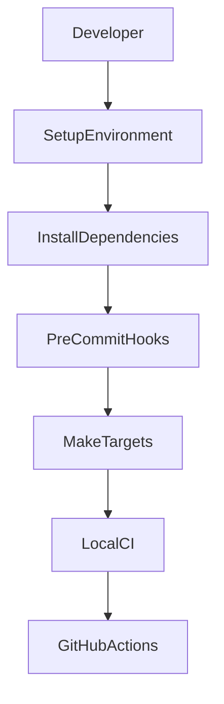
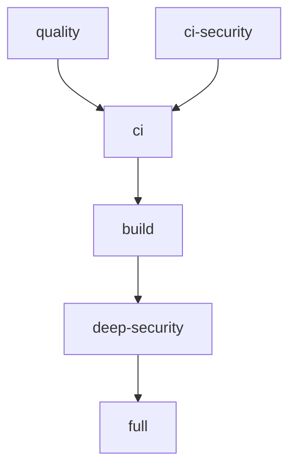
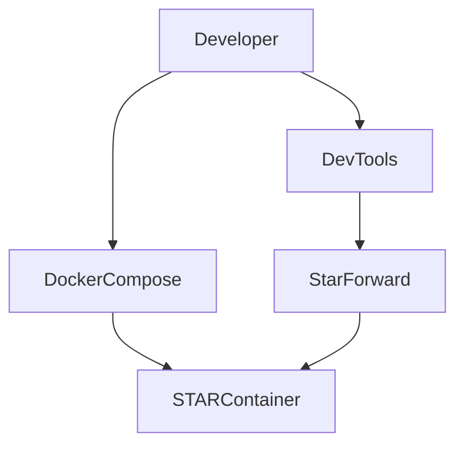

# STAR Development Guide

## Table of Contents

- [0. Quick Start](#0-quick-start)
- [1. Development Overview](#1-development-overview)
- [2. Development Environment Requirements](#2-development-environment-requirements)
- [3. Repository Layout](#3-repository-layout)
- [4. Environment Setup](#4-environment-setup)
- [5. Dependency Sets](#5-dependency-sets)
- [6. Makefile Developer Workflow](#6-makefile-developer-workflow)
- [7. Pre-commit Hooks](#7-pre-commit-hooks)
- [8. Running Individual Checks](#8-running-individual-checks)
- [9. Developer Utilities](#9-developer-utilities)
- [10. Developer Tools Architecture](#10-developer-tools-architecture)
- [11. Reproducing CI Locally](#11-reproducing-ci-locally)
- [12. Troubleshooting](#12-troubleshooting)

## 0. Quick Start

Minimal setup for contributors who want to run the project and execute the local CI checks. To run the full DevSecOps pipeline locally, see [2. Development Environment Requirements](#2-development-environment-requirements) and [4. Environment Setup](#4-environment-setup).

> [!NOTE]
> This guide is for contributors working from a source checkout. If you want to run STAR as a packaged runtime, follow [README.md](README.md) or [deploy/README.md](deploy/README.md) and use the guided `deploy/star` entrypoint.

```bash
git clone https://github.com/Libertocrat/star.git
cd star

pyenv install 3.12
pyenv local 3.12

python -m venv .venv
source .venv/bin/activate

pip install -r requirements/dev.txt
make deps-local

sudo apt update
sudo apt install -y shfmt shellcheck golang-go
go install github.com/rhysd/actionlint/cmd/actionlint@v1.7.12
export PATH="$(go env GOPATH)/bin:$PATH"

pre-commit install
make ci
```

## 1. Development Overview

This document describes the local development workflow for STAR.

It explains how to:

- set up a local development environment
- run STAR locally
- develop and validate DSL-defined actions
- execute quality checks
- reproduce CI pipelines
- use helper utilities in `scripts/` and the `Makefile`

STAR development assumes a Linux environment.

The current development workflow is built around:

- Python 3.12
- Docker
- Make
- Git
- pre-commit
- quality, testing, and security tooling

The `Makefile` provides a consistent interface between local development and the CI pipelines. It also includes local DX commands such as `deps`, `deps-local`, and `fmt`.

Most day-to-day STAR changes fall into one of three loops:

- application and middleware work under `src/star`
- DSL action work under `src/star/actions/specs`
- documentation and OpenAPI export work through `scripts/export_openapi.py` and `scripts/build_docs_site.py`



## 2. Development Environment Requirements

The current local workflow depends on the following tools.

| Tool | Purpose |
| --- | --- |
| Python 3.12 | STAR runtime and development |
| Docker | container runtime and local stack execution |
| Git | version control |
| Make | developer task execution |
| curl | local API checks and helper downloads |
| Go (>= 1.25) | install `actionlint` from source |

Python 3.12 is the supported development version. It can be installed and managed with `pyenv` before creating the project virtual environment.

Additional CLI tools are required for some workflows:

- Manual installation:
  - `hadolint` for Dockerfile linting
  - `jq` for parsing Trivy JSON reports
  - `trivy` for filesystem and image scanning
  - `shfmt` for shell script formatting
  - `shellcheck` for shell script linting
  - `go` and `actionlint` for GitHub Actions workflow linting
- `Makefile` managed:
  - `semgrep` for deep SAST scans

### 2.1 Installing Required CLI Tools

> [!IMPORTANT]
> Some local workflows depend on the system-level CLI tools listed above, that are **not installed through Python requirements**.

The following instructions assume a Debian or Ubuntu based environment.

#### Installing jq

`jq` is a lightweight JSON processor used by some local scripts and security workflows.

Installation:

```bash
sudo apt update
sudo apt install -y jq
```

Verify installation:

```bash
jq --version
```

#### Installing Trivy

Trivy is used for vulnerability scanning of both the repository filesystem and the container image built from the project.

```bash
# Install required packages
sudo apt update
sudo apt install -y wget gnupg lsb-release

# Create keyring directory
sudo mkdir -p /etc/apt/keyrings

# Download Trivy GPG key
wget -qO - https://aquasecurity.github.io/trivy-repo/deb/public.key \
  | gpg --dearmor \
  | sudo tee /etc/apt/keyrings/trivy.gpg > /dev/null

# Add the Trivy repository
echo "deb [signed-by=/etc/apt/keyrings/trivy.gpg] \
https://aquasecurity.github.io/trivy-repo/deb $(lsb_release -sc) main" \
  | sudo tee /etc/apt/sources.list.d/trivy.list

# Update package index
sudo apt update

# Install Trivy
sudo apt install -y trivy
```

Verify installation:

```bash
trivy --version
```

Once installed, the following commands become available locally:

```bash
make trivy-fs
make trivy-image
```

#### Installing Hadolint

`hadolint` is used to lint the project Dockerfile and is also executed by the CI pipeline.

Installation:

```bash
curl -sSL https://github.com/hadolint/hadolint/releases/latest/download/hadolint-Linux-x86_64 \
  -o /usr/local/bin/hadolint

sudo chmod +x /usr/local/bin/hadolint
```

Verify installation:

```bash
hadolint --version
```

#### Installing shfmt and ShellCheck

`shfmt` is used to format shell scripts through `make fmt-shell` and to validate shell formatting through `make lint-shell-format`.

`shellcheck` is used to lint shell scripts through `make lint-shell` after shell formatting validation.

Installation:

```bash
sudo apt update
sudo apt install -y shfmt shellcheck
```

Verify installation:

```bash
shfmt --version
shellcheck --version
```

#### Installing Go and actionlint

`actionlint` is used to validate all workflow files under `.github/workflows/` through `make lint-actions` and is part of `make ci`.

Install Go and `actionlint`:

```bash
sudo apt update
sudo apt install -y golang-go
go version

go install github.com/rhysd/actionlint/cmd/actionlint@v1.7.12
```

Ensure the Go bin path is available:

```bash
export PATH="$(go env GOPATH)/bin:$PATH"
echo 'export PATH="$(go env GOPATH)/bin:$PATH"' >> ~/.bashrc
source ~/.bashrc
```

Verify installation:

```bash
actionlint -version
```

#### Install semgrep

Install with a single command by using the dedicated `Makefile` target.

```bash
make deps-local
```

The command installs `pipx` and `semgrep` and confirms pipx binary is added to `PATH`.

Verify installation:

```bash
semgrep --version
```

## 3. Repository Layout

The repository is organized into a small number of top-level directories.

| Directory | Purpose |
| --- | --- |
| `src/` | STAR application source code, including the DSL build engine, runtime execution layers, file API, and middleware |
| `tests/` | smoke, unit, and integration tests |
| `scripts/` | developer and release helper utilities |
| `docs/` | technical documentation |
| `requirements/` | dependency sets for runtime, testing, linting, security, and development |
| `.github/workflows/` | CI, security, release, and docs publishing workflows |

Detailed technical references are documented in:

- [docs/ARCHITECTURE.md](docs/ARCHITECTURE.md)
- [docs/TESTING.md](docs/TESTING.md)
- [docs/CI.md](docs/CI.md)
- [docs/THREAT_MODEL.md](docs/THREAT_MODEL.md)

### Action development workflow

In STAR, new action behavior is defined through YAML specs and then compiled into runtime action definitions at startup.

The normal workflow is:

1. Add or update a module spec under `src/star/actions/specs`.
2. Let the loader, validator, and builder compile it into the runtime registry during application startup.
3. Inspect the public contract through `GET /v1/actions` or `GET /v1/actions/{action_id}`.
4. Execute it through `POST /v1/actions/{action_id}` with a `params` payload and optional request-level execution options such as `stdout_as_file`.
5. Use `/v1/files` when the action consumes uploaded files or returns managed file outputs.

This is important when reasoning about STAR locally: an action is a controlled command template with a fixed contract, not an arbitrary shell command accepted from the API.

## 4. Environment Setup

Make sure the CLI tools outlined in section [2.1 Installing Required CLI Tools](#21-installing-required-cli-tools) are installed before continuing.

Confirm they exist:

```bash
command -v hadolint jq semgrep trivy shfmt shellcheck actionlint
```

### Python version

Use Python 3.12 before creating the virtual environment.

```bash
pyenv install 3.12
pyenv local 3.12
```

Verify the active interpreter:

```bash
python --version
```

### Virtual environment

Create and activate a local virtual environment.

```bash
python -m venv .venv
source .venv/bin/activate
```

### Install dependencies

Install the development dependency set.

```bash
python -m pip install --upgrade pip
python -m pip install -r requirements/dev.txt
```

`requirements/dev.txt` aggregates runtime, testing, linting, and security dependencies into one local setup.

### Local container stack

The source-tree contributor workflow uses `.env.example`, `docker-compose.yml`, and the helper scripts in `scripts/`.

> [!IMPORTANT]
> Create the `secrets/` directory, generate the API token file, and ensure the external Docker network exists before running `docker compose up`.

Typical local startup flow:

```bash
# Copy and set environment variables
cp .env.example .env

# Set a strong API token in "secrets/star_api_token.txt", or generate one running:
mkdir -p secrets
openssl rand -hex 32 > ./secrets/star_api_token.txt

# Ensure the shared Docker network exists.
# Replace docker-network if you changed STAR_SHARED_NETWORK in .env.
docker network create docker-network || true

docker compose up -d --build
```

`STAR_DATA_VOLUME` controls the named Docker volume used for STAR persistent data.
Set it explicitly in `.env` if you need to isolate storage between local stacks.

To inspect the running stack:

```bash
docker compose logs -f
docker compose ps
```

With the default Compose settings, STAR is published to localhost on `http://localhost:${STAR_HOST_PORT}` while remaining reachable to internal Docker consumers at `http://star:${STAR_PORT}`.

Common authenticated API routes during local development include:

- `GET /v1/actions`
- `GET /v1/actions/{action_id}`
- `POST /v1/actions/{action_id}`
- `POST /v1/files`
- `GET /v1/files/{id}`
- `GET /v1/files/{id}/content`
- `DELETE /v1/files/{id}`

> [!NOTE]
> The compose stack includes an ephemeral `star-init` service that prepares ownership and permissions on `STAR_ROOT_DIR` before the `star` service starts.

When validating action behavior locally, prefer these checks:

- inspect the generated catalog with `GET /v1/actions`
- inspect one public contract with `GET /v1/actions/{action_id}`
- execute one action with `POST /v1/actions/{action_id}` and set `stdout_as_file: true` when validating stdout-to-file materialization
- upload or retrieve supporting files through `/v1/files`
- in the source-tree Compose workflow, set `STAR_ENABLE_DOCS=true` only when you need to inspect `/openapi.json`, `/docs`, or `/redoc` during local development; the packaged `deploy/star` flow uses a different local default for exploration

## 5. Dependency Sets

Python dependencies are split across the `requirements/` directory.

| File | Purpose |
| --- | --- |
| `runtime.txt` | production runtime dependencies |
| `testing.txt` | test framework and test support dependencies |
| `linting.txt` | formatting, linting, typing, and pre-commit tools |
| `security.txt` | security scanning tools |
| `dev.txt` | aggregate development environment |

This separation allows local workflows and CI jobs to install only the dependency sets they need.

`dev.txt` currently aggregates:

- `runtime.txt`
- `testing.txt`
- `linting.txt`
- `security.txt`

## 6. Makefile Developer Workflow

The `Makefile` is the main local developer interface.

Important targets are:

| Target | Purpose |
| --- | --- |
| `make deps` | install Python dependencies from `requirements/dev.txt` |
| `make deps-local` | install local CLI tooling with `pipx` and `semgrep` |
| `make fmt` | apply formatting fixes, including shell formatting with `shfmt` |
| `make fmt-shell` | format shell scripts with `shfmt` |
| `make lint-shell` | validate shell formatting and run ShellCheck for shell scripts |
| `make lint-shell-format` | validate shell formatting with `shfmt` |
| `make lint-actions` | validate GitHub Actions workflows with actionlint |
| `make quality` | run linting, type checking, and tests |
| `make ci` | run the local CI quality gate |
| `make build` | build the Docker image locally |
| `make deep-security` | run Semgrep and Trivy scans |
| `make full` | run the full local pipeline |

Current target behavior:

- `make deps` upgrades `pip` and installs `requirements/dev.txt`
- `make deps-local` installs `pipx`, installs `semgrep` with `pipx`, and reminds the developer to install Trivy system-wide
- `make fmt-shell` runs `shfmt -w -i 4 -ci -sr` on detected shell scripts
- `make fmt` runs `fmt-shell`, `black`, `ruff check --fix`, `trailing-whitespace`, and `end-of-file-fixer`
- `make lint-shell-format` runs `shfmt -d -i 4 -ci -sr` on detected shell scripts
- `make lint-shell` runs `lint-shell-format` followed by `shellcheck -x`
- `make lint` runs `lint-shell`, `lint-actions`, `black --check`, and `ruff check`
- `make quality` runs `lint`, `typecheck`, and `test`
- `make ci` runs `quality` and `ci-security`
- `make build` runs `docker build -t star:local .`
- `make deep-security` runs `semgrep`, `trivy-fs`, and `trivy-image`
- `make full` runs `ci`, `build`, and `deep-security`

These commands mirror the CI pipelines documented in [docs/CI.md](docs/CI.md), except for local DX oriented commands such as `fmt`, `deps`, and `deps-local`.



## 7. Pre-commit Hooks

STAR uses `pre-commit` to enforce local quality checks before changes move into CI.

The current hook set includes:

- trailing whitespace cleanup
- end-of-file fixer
- YAML validation
- Black formatting
- Ruff linting with `--fix`
- shfmt shell formatting
- ShellCheck shell linting
- MyPy type checking for `src/` and `tests/`
- Bandit security scanning for `src/`
- Hadolint for `Dockerfile`
- pytest execution for `tests/`

Install and enable the hooks with:

```bash
pre-commit install
```

Run the full hook set manually with:

```bash
pre-commit run --all-files
```

## 8. Running Individual Checks

Direct commands are useful for fast local iteration.

Formatting:

```bash
shfmt -w -i 4 -ci -sr $(SHELL_FILES)
black src tests scripts
```

Linting:

```bash
ruff check --fix src tests scripts
```

Shell scripts:

```bash
shfmt -d -i 4 -ci -sr $(SHELL_FILES)
shellcheck -x $(SHELL_FILES)
```

GitHub Actions workflows:

```bash
actionlint
```

Typing:

```bash
mypy --config-file mypy.ini src tests scripts
```

Testing:

```bash
pytest -q tests
```

Integration tests:

```bash
pytest -q tests/integration
```

## 9. Developer Utilities

The repository includes developer utilities in `scripts/`.

That directory has its own reference document in [scripts/README.md](scripts/README.md).

### 9.1 STAR Local Port Forwarding

Script:

`scripts/star-forward.sh`

Purpose:

Create a temporary localhost port forward to a running STAR container.

This helper is optional with the default Compose configuration and is mainly useful when host publishing is disabled or when a temporary alternate local port is needed.

Common uses:

- access Swagger UI
- send `curl` requests
- run host-side integration checks against the containerized service
- inspect API behavior when Compose host publishing is disabled

The script uses a temporary `alpine/socat` container on the shared Docker network.

Required variables:

| Variable | Purpose |
| --- | --- |
| `STAR_SHARED_NETWORK` | Docker network |
| `STAR_PORT` | STAR container port |
| `COMPOSE_PROJECT_NAME` | container autodetection prefix |

Example usage:

```bash
scripts/star-forward.sh --env-file .env
```

The script always prints:

```text
http://localhost:<PORT>/health
```

When `STAR_ENABLE_DOCS=true`, it also prints:

```text
http://localhost:<PORT>/docs
http://localhost:<PORT>/openapi.json
```

`PORT` is auto-assigned by default or can be set with `--local-port`.

More details are available in [scripts/README.md](scripts/README.md) and through the script's `--help` output.

## 10. Developer Tools Architecture

The local developer utilities are designed to improve DX without changing the production container configuration.



The local tools operate around the main container stack rather than changing the application runtime model.

## 11. Reproducing CI Locally

Developers can reproduce the main CI quality gate locally with:

```bash
make ci
```

This runs:

- linting
- shell script formatting validation through shfmt
- shell script linting through ShellCheck
- workflow linting through actionlint
- type checking
- tests
- baseline security checks through Bandit, pip-audit, and Hadolint

For deeper local validation, run:

```bash
make full
```

This adds:

- Docker image build
- Semgrep
- Trivy filesystem scan
- Trivy image scan

The blocking Semgrep gate excludes the GitHub Actions mutable-action-tag rule.
STAR treats SHA pinning for workflow actions as hardening work while the workflow
policy allows reviewed stable major versions.

Note that `make ci` and `make full` require the relevant local tools to be installed. In particular, `hadolint`, `jq`, `semgrep`, `trivy`, `shfmt`, `shellcheck`, and `actionlint` are not installed by `requirements/dev.txt`.

## 12. Troubleshooting

### Clear the MyPy cache and rerun the CI gate

```bash
rm -rf .mypy_cache && make ci
```

### Verify the active Python version

```bash
python --version
```

### Verify installed Python dependencies

```bash
pip freeze
```

### Verify required local CLI tools

```bash
command -v hadolint jq semgrep trivy shfmt shellcheck actionlint
```

### actionlint not found in PATH

If `make lint-actions` fails with `actionlint: command not found`, install it with Go and export `GOPATH/bin`.

```bash
go install github.com/rhysd/actionlint/cmd/actionlint@v1.7.12
export PATH="$(go env GOPATH)/bin:$PATH"
actionlint -version
```

### Semgrep crashes after update

If `semgrep` fails to run or crashes after an update (for example with a segmentation fault), reinstall it using pipx.

```bash
pipx uninstall semgrep
make deps-local
```

This forces `pipx` to recreate the isolated environment used by the Semgrep CLI.

### Inspect helper script usage

```bash
scripts/star-forward.sh --help
```

---
