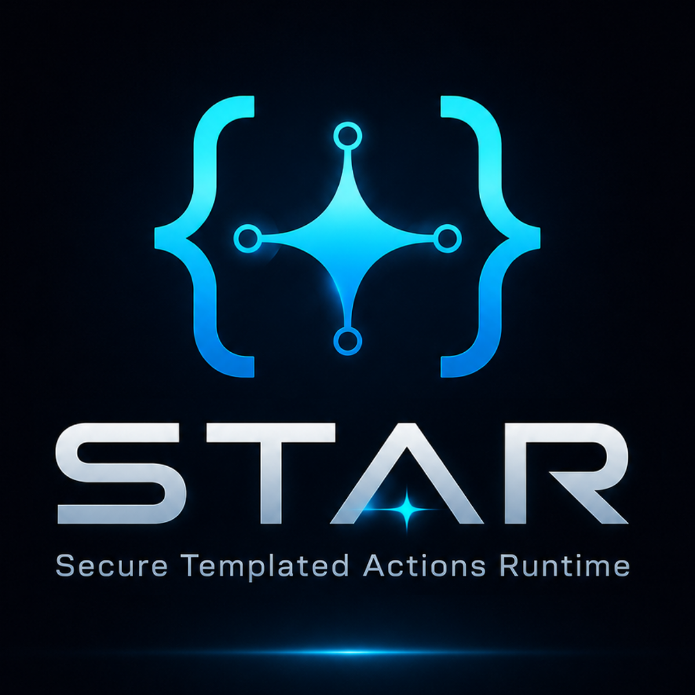
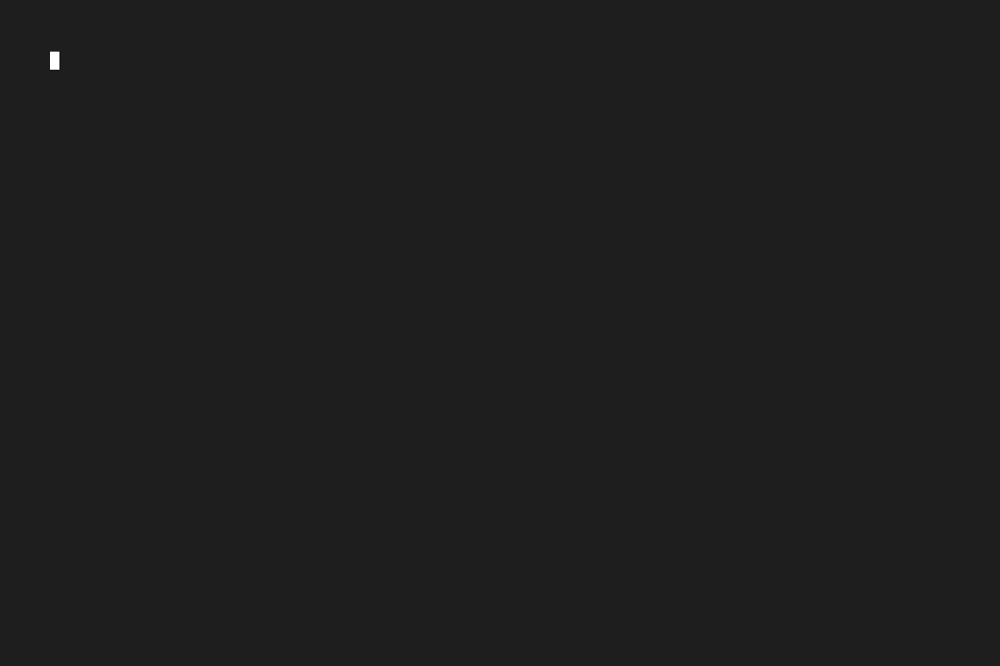
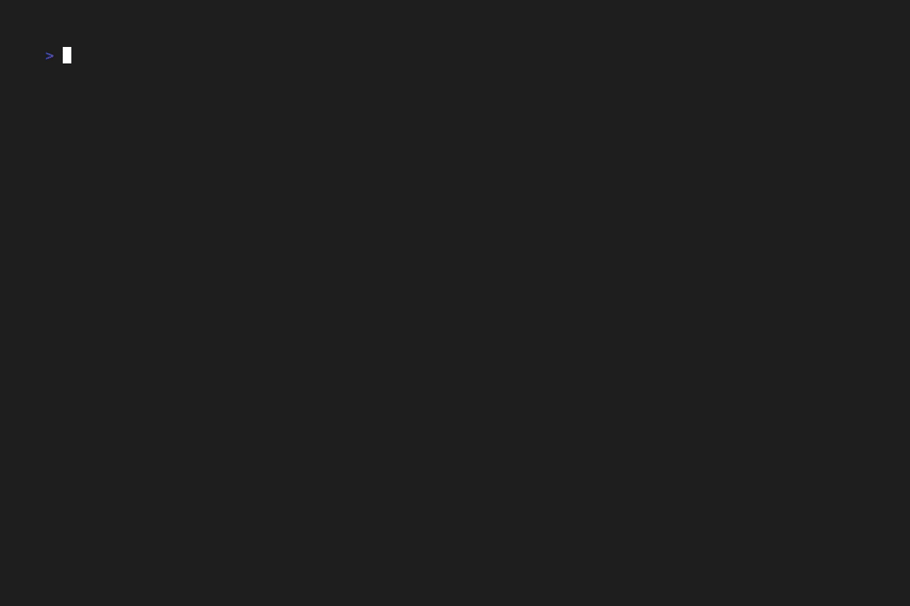
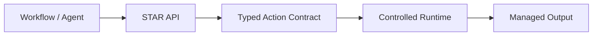

<h1 align="center">STAR - Secure Templated Actions Runtime</h1>

<p align="center">
  Safe actions. No raw shell.
</p>

<p align="center">
  
</p>

<p align="center">
  <em>
    STAR lets workflows, AI agents, and low-code automations run safe, predefined actions through an authenticated API, without exposing raw shell execution.
  </em>
  <br>
  <em>
    Use real system capabilities without giving workflows or agents a general-purpose command runner.
  </em>
</p>

<p align="center">
  <a href="https://github.com/Libertocrat/star/releases">
    
  </a>
  <a href="https://github.com/Libertocrat/star/blob/main/LICENSE">
    
  </a>
  <a href="https://github.com/Libertocrat/star/actions/workflows/ci.yml">
    
  </a>
  <a href="https://github.com/Libertocrat/star/actions/workflows/security.yml">
    
  </a>
  <a href="https://github.com/Libertocrat/star/actions/workflows/release.yml">
    
  </a>
  <a href="https://github.com/Libertocrat/star/pkgs/container/star">
    
  </a>
  <a href="https://www.python.org/">
    
  </a>
  <a href="https://libertocrat.github.io/star/api-docs/">
    
  </a>
</p>

---

## Table of Contents

- [Quick Start](#quick-start)
- [See STAR in Action](#see-star-in-action)
- [Why STAR?](#why-star)
- [What STAR Gives You](#what-star-gives-you)
- [How STAR Works](#how-star-works)
- [Documentation](#documentation)
- [Security Applicability](#security-applicability)
- [Roadmap](#roadmap)
- [Security Reporting](#security-reporting)
- [License](#license)

## Quick Start

The fastest current path is to download the deploy bundle from the latest GitHub release, extract it, and launch STAR from there. Run this to set up and start STAR:

```bash
curl -fsSL https://github.com/Libertocrat/star/releases/latest/download/star-deploy.tar.gz -o star-deploy.tar.gz && \
tar -xzf star-deploy.tar.gz && \
cd star-deploy
```

That leaves `./star` available as the top-level STAR lifecycle command.

### Fast Deploy

```bash
./star --auto
./star status
```

This is the fastest path to a configured local runtime and a quick health check.

<p align="center">
  
</p>

> [!IMPORTANT]
> STAR is designed to be managed from the top-level `./star` command.
>
> You should not need to edit Docker Compose files, manually create secrets, or enter `star-runtime/` for the normal local workflow.

This gives you the local runtime control surface:

- `./star` for the guided interactive flow
- `./star --auto` for a non-interactive default deploy
- `./star demo` for built-in API demos
- `./star status` to inspect package, Docker, runtime, health, and docs state
- `./star logs -f` to follow runtime logs
- `./star down` to safely stop the runtime
- `./star help` to access command help

Requirements for the deploy flow are Docker and Docker Compose v2. Built-in demos also use `curl` and `jq`; if they are missing, the demo flow can prompt to install them automatically when possible. Most users should manage STAR from the directory that contains `./star`, without entering `star-runtime/` except to adjust `.env`, inspect the API token, or add custom YAML specs.

## See STAR in Action

The `./star` orchestrator is the primary lifecycle interface for package users. After deploying with `./star --auto` or `./star`, you may explore its capabilities using the `demo` command. Below is a live example.

### Interactive Demo (File Encryption)

```bash
./star demo
```

This guided demo shows STAR handling a file through safe, predefined encryption and decryption actions instead of raw shell-driven workflow logic.

<p align="center">
  
</p>

Other built-in demos, accessed by running `./star demo`, include:

- Files API walkthrough
- Actions API walkthrough
- Generate random tokens
- Measure and inspect a text file
- Search patterns in a text file

## Why STAR?

Automation builders often need file operations, data transformation, inspection, artifact generation, or system helpers. The common shortcut is raw shell execution or a similarly broad runtime primitive.

That shortcut is flexible, but it is also broad, hard to audit, and dangerous in workflow and agent systems. Small mistakes in prompt handling, workflow logic, file access, or runtime exposure can become much larger incidents when arbitrary execution is available.

STAR replaces that pattern with authenticated, typed, allow-listed API actions. Use STAR when your automation needs real system capabilities, but you do not want to give workflows or agents a general-purpose command runner.

> [!IMPORTANT]
> STAR is designed to reduce exposure from unsafe automation patterns, not to magically remove all risk.
>
> Its core value is replacing open-ended command execution with predefined, validated, controlled operations that are easier to audit, constrain, and reason about.

## What STAR Gives You

- a safer action/execution layer for workflows and AI agents
- a clean HTTP API for predefined operations
- managed file handling without exposing raw host paths
- authenticated discovery and execution through `/v1/actions`
- upload, metadata, download, list, and delete flows through `/v1/files`
- Docker-first local runtime with sensible security defaults
- built-in lifecycle tooling through `./star`
- OpenAPI docs for local exploration and integration

Under the hood, actions are defined as typed YAML specs, validated at startup, and compiled into a runtime registry before they can be invoked.

> [!WARNING]
> STAR intentionally narrows what callers can do. If your use case depends on arbitrary shell execution, STAR is designed to replace that pattern, not wrap it in a thinner UI.
> Users may define their own custom actions to cover their execution needs in a safer way.

## How STAR Works

At a high level, STAR sits between an automation/AI system and the real system effects that would otherwise be exposed through raw command execution.



### Before / After

| Pattern | Flow |
| --- | --- |
| Unsafe default | Workflow or agent -> arbitrary shell command -> broad system effects |
| STAR model | Workflow or agent -> authenticated STAR API -> validated params -> controlled runtime -> managed outputs |

STAR still executes real commands under the hood, but only through validated action contracts, no-shell execution paths, managed files, policy checks, and sanitized outputs.

## Documentation

Use this README for the quick overview, then go deeper through the focused docs:

- [deploy/README.md](deploy/README.md) for the runtime package guide focused on `./star`, lifecycle commands, and deploy-bundle usage
- [DEVELOPMENT.md](DEVELOPMENT.md) for local development workflow and environment setup
- [docs/ARCHITECTURE.md](docs/ARCHITECTURE.md) for system design, action pipeline, and runtime behavior
- [docs/THREAT_MODEL.md](docs/THREAT_MODEL.md) for security boundaries, trust assumptions, and mitigations
- [docs/AI_SECURITY.md](docs/AI_SECURITY.md) for STAR's applicability to OWASP LLM Top 10, MITRE ATLAS, and AI-agent tool-execution risks
- [docs/TESTING.md](docs/TESTING.md) for test strategy and execution
- [docs/CI.md](docs/CI.md) for CI, security workflow, release pipeline, and docs publication
- [CONTRIBUTING.md](CONTRIBUTING.md) for contribution policy
- [SECURITY.md](SECURITY.md) for vulnerability disclosure and reporting
- [scripts/README.md](scripts/README.md) for helper dev/ci scripts
- [STAR OpenAPI Docs](https://libertocrat.github.io/star/api-docs/) for hosted API documentation by release. For interactive API docs, deploy STAR locally.

## Security Applicability

STAR is designed to act as a constrained tool-execution boundary in automation and agentic systems.

It does not replace model-layer safety, RAG security, RBAC, human approval, or deployment hardening. Its role is narrower: reduce the blast radius when workflows or agents need to trigger real system actions.

### Workflow Automation RCE Context

STAR was born from a practical security problem: modern automation platforms often need to perform real system actions, but exposing broad command execution or overly flexible workflow-side code execution can turn small automation mistakes into full runtime compromise.

That concern became especially concrete after multiple n8n vulnerabilities disclosed across late 2025 and early 2026 illustrate how workflow automation features, expression evaluation, sandboxing, file access, and code-execution primitives can become high-impact attack paths. Relevant examples include [CVE-2025-68613](https://nvd.nist.gov/vuln/detail/CVE-2025-68613), [CVE-2026-21858](https://nvd.nist.gov/vuln/detail/CVE-2026-21858), [CVE-2026-21877](https://nvd.nist.gov/vuln/detail/CVE-2026-21877), [CVE-2026-27497](https://nvd.nist.gov/vuln/detail/CVE-2026-27497), [CVE-2026-33660](https://nvd.nist.gov/vuln/detail/CVE-2026-33660), and [CVE-2026-42234](https://nvd.nist.gov/vuln/detail/CVE-2026-42234).

> [!IMPORTANT]
> STAR is not an n8n patch, an LLM firewall, a RAG security product, or a full agent policy engine. It is a constrained tool-execution boundary that helps reduce the blast radius of unsafe tool invocation, command execution, file access, and unbounded runtime behavior.

### OWASP Top 10 for LLM Applications

| OWASP risk | STAR relevance |
| --- | --- |
| [LLM01:2025 Prompt Injection](https://genai.owasp.org/llmrisk/llm01-prompt-injection/) | STAR does not detect prompt injection, but it helps contain prompt-to-tool abuse by exposing predefined, validated actions instead of arbitrary command execution. |
| [LLM02:2025 Sensitive Information Disclosure](https://genai.owasp.org/llmrisk/llm022025-sensitive-information-disclosure/) | STAR helps reduce disclosure paths through authenticated endpoints, managed file IDs, storage boundaries, and output/path sanitization. |
| [LLM05:2025 Improper Output Handling](https://genai.owasp.org/llmrisk/llm052025-improper-output-handling/) | STAR sanitizes stdout/stderr, strips unsafe control sequences, redacts sensitive paths, and bounds returned output. |
| [LLM06:2025 Excessive Agency](https://genai.owasp.org/llmrisk/llm062025-excessive-agency/) | STAR helps reduce excessive agency by constraining execution to predefined, typed, allow-listed actions. |
| [LLM10:2025 Unbounded Consumption](https://genai.owasp.org/llmrisk/llm102025-unbounded-consumption/) | STAR applies request-size limits, timeouts, rate limiting, upload limits, and bounded runtime output. |

### MITRE ATLAS Techniques Relevant to STAR

| MITRE ATLAS technique | STAR relevance |
| --- | --- |
| [AML.T0050 Command and Scripting Interpreter](https://atlas.mitre.org/techniques/AML.T0050) | STAR replaces public shell-style execution with validated action contracts and no-shell subprocess execution. |
| [AML.T0051 LLM Prompt Injection](https://atlas.mitre.org/techniques/AML.T0051) | STAR does not classify prompt intent, but it narrows what a compromised or manipulated agent can invoke downstream. |
| [AML.T0053 AI Agent Tool Invocation](https://atlas.mitre.org/techniques/AML.T0053) | STAR acts as a constrained tool boundary for AI agents and workflow systems. |
| [AML.T0037 Data from Local System](https://atlas.mitre.org/techniques/AML.T0037) | STAR reduces arbitrary local-file exposure through managed file APIs, UUID-based file references, and sandboxed storage. |
| [AML.T0086 Exfiltration via AI Agent Tool Invocation](https://atlas.mitre.org/techniques/AML.T0086) | STAR narrows exfiltration paths through constrained actions, file controls, output sanitization, and blocked binaries. |
| [AML.T0072 Reverse Shell](https://atlas.mitre.org/techniques/AML.T0072) | STAR reduces common reverse-shell pathways by avoiding shell-based public execution primitives. |
| [AML.T0029 Denial of AI Service](https://atlas.mitre.org/techniques/AML.T0029) | STAR applies request-size checks, timeouts, and rate limiting to reduce simple service-exhaustion pressure. |
| [AML.T0034 Excessive Queries](https://atlas.mitre.org/techniques/AML.T0034) | STAR helps reduce repeated abusive invocation patterns through API throttling and runtime limits. |
| [AML.T0049 Exploit Public-Facing Application](https://atlas.mitre.org/techniques/AML.T0049) | STAR hardens the execution boundary with authentication, request-integrity checks, structured errors, and runtime controls. |

For the full analysis, see [docs/AI_SECURITY.md](docs/AI_SECURITY.md).

## Roadmap

### Near term

- implement an MCP server for safe action discovery, tag/intention-based action lookup, action execution, and managed file operations
- publish AI-agent and n8n integration examples
- expand the built-in safe action catalog

### MCP and agent integration

- expose `/v1/actions` discovery through MCP resources and tools
- support action lookup by tags, capability, and caller intent
- support safe action execution through MCP with typed parameters and bounded outputs
- expose managed file operations from `/v1/files` through MCP for agent-accessible upload, metadata, content, listing, and deletion flows
- document secure agent integration patterns for assistants, development pipelines, and workflow engines

### Action DSL evolution

- add postprocessing operations such as trim, split, regex capture, and structured outputs
- support controlled multi-command pipelines for advanced actions
- improve action packaging, reuse, and provenance validation

### Security and policy

- add JWT-based authentication and authorization
- introduce action risk tiers, policy hooks, and caller identity propagation
- expand output redaction beyond invocation-provided secrets to API keys, tokens, and PII
- add static and dynamic malware scanning through a dedicated microservice
- improve service-to-service security with mTLS for trusted internal deployments

### Runtime, storage, and integrations

- add MinIO/S3-backed managed file storage
- explore gRPC for efficient internal service communication
- add safe same-network file transfer patterns for microservice workflows
- add dedicated media-processing docker images with ffmpeg, audio, and image tooling
- add local and remote backup utilities for better developer and management experience

## Security Reporting

Do not report vulnerabilities in public issues.

Use the coordinated disclosure process documented in [SECURITY.md](SECURITY.md). For encrypted reporting, the repository includes [SECURITY_PGP_KEY.asc](SECURITY_PGP_KEY.asc).

## License

STAR is licensed under the GNU Affero General Public License v3.0. See [LICENSE](LICENSE) for the full text.

The AGPLv3 allows use, modification, distribution, private use, and commercial use under its terms. Those terms include preserving license and copyright notices, providing corresponding source when distributing covered versions, and making source available for modified versions that users interact with over a network.

Commercial licenses may be available for proprietary use cases that cannot comply with the AGPLv3, including closed-source products or packaged commercial offerings based on STAR. Contact Libertocrat at <libertocrat@proton.me> to discuss a separate commercial license.

---
