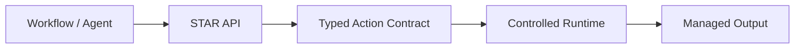

<h1 align="center">STAR - Secure Templated Actions Runtime</h1>

<p align="center">
  Safe actions. No raw shell.
</p>

<p align="center">
  
</p>

<p align="center">
  <em>
    STAR - Secure Templated Actions Runtime - is a secure automation runtime for workflows and AI agents, that replaces arbitrary command execution with DSL-defined, templated operations.
  </em>
  <br>
  <em>
    Run predefined actions instead of arbitrary shell commands.
  </em>
</p>

<p align="center">
  <a href="https://github.com/Libertocrat/star/releases">
    
  </a>
  <a href="https://github.com/Libertocrat/star/blob/main/LICENSE">
    
  </a>
  <a href="https://github.com/Libertocrat/star/actions/workflows/ci.yml">
    
  </a>
  <a href="https://github.com/Libertocrat/star/actions/workflows/security.yml">
    
  </a>
  <a href="https://github.com/Libertocrat/star/actions/workflows/release.yml">
    
  </a>
  <a href="https://github.com/Libertocrat/star/pkgs/container/star">
    
  </a>
  <a href="https://www.python.org/">
    
  </a>
  <a href="https://libertocrat.github.io/star/api-docs/">
    
  </a>
</p>

---

## Table of Contents

- [Why STAR](#why-star)
- [Quick Start](#quick-start)
- [See STAR in Action](#see-star-in-action)
- [What STAR Gives You](#what-star-gives-you)
- [How STAR Works](#how-star-works)
- [Security Discoverability](#security-discoverability)
- [Documentation](#documentation)
- [Roadmap](#roadmap)
- [Security Reporting](#security-reporting)
- [License](#license)

## Why STAR

STAR is a secure automation runtime that lets workflows, AI agents, and low-code builders run predefined actions instead of arbitrary shell commands.

It exposes a typed, authenticated API for allow-listed actions and managed file operations. Instead of letting callers send raw shell, STAR loads YAML-defined actions, validates them at startup, builds an immutable runtime registry, and only accepts parameters declared by those actions.

> [!IMPORTANT]
> STAR is designed to reduce exposure from unsafe automation patterns, not to magically remove all risk.
>
> Its core value is replacing open-ended command execution with predefined, validated, controlled operations that are easier to audit, constrain, and reason about.

Automation platforms often need to read files, transform data, inspect content, generate artifacts, or run system-level helpers. The common shortcut is to expose a broad command-execution primitive. That shortcut is flexible, but it also expands the blast radius of prompt injection, workflow misconfiguration, sandbox escape, and file-handling mistakes.

STAR takes a different approach:

- typed actions instead of raw shell
- validated parameters instead of free-form command strings
- managed files instead of arbitrary path exposure
- authenticated API access instead of anonymous execution surfaces
- rootless container execution with runtime guardrails

> [!NOTE]
> Public automation incidents in platforms such as n8n have shown how dangerous code-execution, expression-evaluation, and unsafe file-handling features can become in workflow systems. STAR is positioned as an architectural containment layer for those classes of problems.

## Quick Start

The fastest current path is to download only the deployment package, extract, and launch STAR from there. Execute this to have STAR setup and running:

```bash
tmpdir="$(mktemp -d)" && \
curl -fsSL https://github.com/Libertocrat/star/archive/refs/heads/main.tar.gz -o "$tmpdir/star.tar.gz" && \
tar -xzf "$tmpdir/star.tar.gz" -C "$tmpdir" && \
cp -a "$tmpdir"/star-main/deploy/star "$tmpdir"/star-main/deploy/star-runtime . && \
chmod +x ./star ./star-runtime/scripts/*.sh && \
rm -rf "$tmpdir" && \
./star
```

That command leaves `./star` available as the top-level STAR lifecycle command. From there, you use `./star` to configure STAR, start it, inspect status, run built-in tutorials, follow logs, and stop the runtime without managing the internal Docker workflow by hand.

This gives you the local runtime control surface:

- `./star` for the guided interactive flow
- `./star --auto` for a non-interactive default deploy
- `./star demo` for built-in API demos
- `./star status` to inspect package, Docker, runtime, health, and docs state
- `./star down` to safely stop the runtime
- `./star help` to access help docs

> [!IMPORTANT]
> STAR currently uses the repository tarball as its fast-deploy bootstrap.
> A dedicated release bundle is planned so this step can become a shorter `curl | tar` flow later.

Requirements for the deploy flow are Docker and Docker Compose v2. Built-in demos also use `curl` and `jq`; if they are missing, the demo flow can prompt to install them automatically when possible. Most users should manage STAR from the directory that contains `./star`, without entering `star-runtime/` except to adjust `.env`, inspect the API token, or add custom YAML specs.

## See STAR in Action

The `./star` orchestrator is the primary lifecycle interface for package users. The walkthrough below is structured like a lightweight tutorial so each command has a clear purpose before the animated demos are added.

### 1. Guided Startup

Run the interactive flow when you want STAR to guide configuration and startup step by step.

```bash
./star
```

This gets STAR configured, creates the base local runtime files, and leaves the service ready to use.

<!-- GIF placeholder: Guided startup tutorial. Show a user running ./star in a clean directory, accepting the configuration prompts, letting STAR start the runtime, and ending on the post-start next steps. Focus on the orchestrator as the main entrypoint and keep terminal output readable. -->

### 2. Fast Non-Interactive Deploy

Run the auto mode when you want STAR configured and started with default behavior and minimal decisions.

```bash
./star --auto
```

This is the quickest path to get STAR ready and running with the default local settings.

<!-- GIF placeholder: Auto deploy tutorial. Show ./star --auto configuring STAR, creating any required local runtime state, starting the Docker runtime, and finishing with a healthy service. Make the sequence feel like a one-command fast deploy story. -->

### 3. Built-In Demo Flow

Run the demo entrypoint to explore the STAR API through guided scenarios.

```bash
./star demo
```

This opens STAR's built-in tutorials so you can explore the runtime step by step.

The current built-in tutorials cover:

- Files API walkthrough
- Actions API walkthrough
- Generate random tokens
- Measure and inspect a text file
- Search patterns in a text file
- Encrypt and decrypt a file

<!-- GIF placeholder: Demo tutorial for ./star demo. Show the interactive demo menu, pick the encrypt and decrypt walkthrough manually, follow the prompts step by step, and finish on the demo summary. Keep the flow beginner-friendly and focused on the outcome of learning STAR through built-in tutorials. -->

### 4. Runtime Status and Logs

Inspect package health, runtime reachability, and docs availability from the orchestrator.

```bash
./star status
./star logs -f
```

Use this when you want a quick "is STAR healthy?" check and a live view of what the runtime is doing.

<!-- GIF placeholder: Status and logs tutorial. Show ./star status first to inspect package, Docker, service, health, and docs state, then switch to ./star logs -f to follow runtime output while STAR is running. Emphasize that routine runtime inspection stays anchored on the top-level ./star command. -->

### 5. Swagger / OpenAPI Exploration

In the default deploy flow, STAR enables Swagger / OpenAPI docs for local testing and demos. You can use them to explore `/v1/actions` and `/v1/files` interactively.

Run `./star status` to get the docs URL, then open `/docs` and try the API interactively.

```bash
./star status
```

<!-- GIF placeholder: Swagger exploration tutorial. Show a default local STAR deployment, run ./star status to reveal the docs URL, open the Swagger UI, browse /v1/actions and /v1/files, execute a simple request in the interactive docs, and return to the terminal. Mention in the flow that --production disables docs by default. -->

## What STAR Gives You

- DSL-defined, allow-listed actions compiled at startup into an immutable registry
- authenticated API access for discovery and execution through `/v1/actions`
- managed file upload, listing, metadata, download, and delete flows through `/v1/files`
- deterministic command rendering with typed params, flags, defaults, and declared outputs
- rootless container deployment with configurable runtime limits and response hardening
- built-in `./star` lifecycle commands for configure, startup, demos, status, logs, and shutdown
- OpenAPI support for local exploration, enabled by default in the standard local deploy flow

> [!WARNING]
> STAR intentionally narrows what callers can do. If your use case depends on arbitrary shell execution, STAR is designed to replace that pattern, not to wrap it in a thinner UI.
> You can define custom actions if the command execution you need isn't covered by our base actions.

## How STAR Works

At a high level, STAR sits between an automation system and the real system effects that would otherwise be exposed through raw command execution.



### Before / After

| Pattern | Flow |
| --- | --- |
| Unsafe default | Workflow or agent -> arbitrary shell command -> broad system effects |
| STAR model | Workflow or agent -> authenticated STAR API -> validated params -> controlled runtime -> managed outputs |

STAR still executes real commands under the hood, but only after validating the DSL, validating request payloads, enforcing runtime policy, constraining file access, and sanitizing outputs.

## Security Discoverability

This section is intentionally brief and index-friendly. It is not a full threat model.

> [!IMPORTANT]
> The items below are included to help users, researchers, and security indexers understand where STAR is relevant.
>
> STAR should be described as helping mitigate, reducing exposure to, or containing the blast radius of these categories. It is not a direct patch for third-party CVEs.

### OWASP LLM Top 10 Risks STAR Helps Address

| OWASP risk | STAR mitigation / protection |
| --- | --- |
| [LLM01:2025 Prompt Injection](https://genai.owasp.org/llmrisk/llm01-prompt-injection/) | STAR helps mitigate prompt-to-action abuse by exposing a validated action surface instead of arbitrary command execution. |
| [LLM02:2025 Sensitive Information Disclosure](https://genai.owasp.org/llmrisk/llm022025-sensitive-information-disclosure/) | STAR helps reduce disclosure risk through authenticated endpoints, managed file IDs, storage boundaries, and output/path sanitization. |
| [LLM05:2025 Improper Output Handling](https://genai.owasp.org/llmrisk/llm052025-improper-output-handling/) | STAR helps mitigate unsafe tool-output handling by sanitizing stdout/stderr, stripping unsafe control sequences, redacting sensitive paths, and bounding returned output. |
| [LLM06:2025 Excessive Agency](https://genai.owasp.org/llmrisk/llm062025-excessive-agency/) | STAR helps reduce excessive agency by constraining execution to predefined, typed actions instead of unrestricted tool access. |
| [LLM10:2025 Unbounded Consumption](https://genai.owasp.org/llmrisk/llm102025-unbounded-consumption/) | STAR helps reduce abuse and overload through request-size limits, timeouts, rate limiting, and bounded runtime output. |

### MITRE ATLAS Techniques Relevant to STAR

| ATLAS technique | STAR mitigation / protection |
| --- | --- |
| [AML.T0050 Command and Scripting Interpreter](https://atlas.mitre.org/techniques/AML.T0050) | STAR helps mitigate open command-execution exposure by replacing it with validated, allow-listed action execution. |
| [AML.T0051 LLM Prompt Injection](https://atlas.mitre.org/techniques/AML.T0051) | STAR helps reduce the downstream blast radius of prompt-driven tool misuse, even though it does not classify prompt intent itself. |
| [AML.T0053 AI Agent Tool Invocation](https://atlas.mitre.org/techniques/AML.T0053) | STAR helps protect agent integrations by acting as a constrained tool-execution boundary. |
| [AML.T0037 Data from Local System](https://atlas.mitre.org/techniques/AML.T0037) | STAR helps mitigate arbitrary local-file exposure through managed file APIs and sandboxed storage rules. |
| [AML.T0086 Exfiltration via AI Agent Tool Invocation](https://atlas.mitre.org/techniques/AML.T0086) | STAR helps reduce exfiltration paths through constrained actions, file controls, and output sanitization. |
| [AML.T0072 Reverse Shell](https://atlas.mitre.org/techniques/AML.T0072) | STAR helps reduce common reverse-shell pathways by avoiding shell-based public execution primitives. |
| [AML.T0029 Denial of AI Service](https://atlas.mitre.org/techniques/AML.T0029) | STAR helps mitigate simple service-exhaustion pressure with request-size checks, timeouts, and rate limiting. |
| [AML.T0034 Excessive Queries](https://atlas.mitre.org/techniques/AML.T0034) | STAR helps reduce repeated abusive invocation patterns at the API boundary through throttling and runtime limits. |
| [AML.T0049 Exploit Public-Facing Application](https://atlas.mitre.org/techniques/AML.T0049) | STAR helps harden the execution boundary with authentication, request-integrity checks, and runtime controls. |

### Selected n8n CVEs STAR Helps Mitigate by Design

| CVE | STAR mitigation / protection |
| --- | --- |
| [CVE-2025-68613](https://nvd.nist.gov/vuln/detail/CVE-2025-68613) | STAR helps mitigate this class of expression-driven RCE by replacing free-form execution patterns with predefined, validated actions. |
| [CVE-2026-21858](https://nvd.nist.gov/vuln/detail/CVE-2026-21858) | STAR helps reduce exposure by constraining file access to managed APIs and sandboxed storage rules instead of broad workflow-side file handling. |
| [CVE-2026-21877](https://nvd.nist.gov/vuln/detail/CVE-2026-21877) | STAR helps reduce unsafe code/file handling exposure by narrowing execution and managed file-ingestion surfaces. |
| [CVE-2026-27497](https://nvd.nist.gov/vuln/detail/CVE-2026-27497) | STAR helps mitigate this style of ad hoc workflow-side code execution by replacing it with constrained action contracts. |
| [CVE-2026-33660](https://nvd.nist.gov/vuln/detail/CVE-2026-33660) | STAR helps reduce Merge-node-style local-file read and RCE exposure by avoiding broad workflow execution features. |
| [CVE-2026-42234](https://nvd.nist.gov/vuln/detail/CVE-2026-42234) | STAR helps reduce reliance on embedded general-purpose code nodes by shifting automation to predefined actions. |

> [!NOTE]
> Some of the n8n CVEs listed above are not one-to-one equivalents of the old Execute Command pattern. They are included because they illustrate the broader class of workflow-side code execution, unsafe file access, and overly flexible runtime features that STAR is intended to replace or contain.

## Documentation

Use this README for the quick overview, then go deeper through the focused docs:

- [deploy/README.md](deploy/README.md) for the runtime package guide focused on `./star`, lifecycle commands, and deploy-bundle usage
- [DEVELOPMENT.md](DEVELOPMENT.md) for local development workflow and environment setup
- [docs/ARCHITECTURE.md](docs/ARCHITECTURE.md) for system design, action pipeline, and runtime behavior
- [docs/THREAT_MODEL.md](docs/THREAT_MODEL.md) for security boundaries, trust assumptions, and mitigations
- [docs/TESTING.md](docs/TESTING.md) for test strategy and execution
- [docs/CI.md](docs/CI.md) for CI, security workflow, release pipeline, and docs publication
- [CONTRIBUTING.md](CONTRIBUTING.md) for contribution policy
- [SECURITY.md](SECURITY.md) for vulnerability disclosure and reporting
- [scripts/README.md](scripts/README.md) for helper scripts
- [STAR OpenAPI Docs](https://libertocrat.github.io/star/api-docs/) for hosted API documentation by release

## Roadmap

- ship a dedicated deploy bundle for a shorter one-command installation flow
- expand the built-in action catalog while preserving tight execution boundaries
- publish more visual demos, including full lifecycle and Swagger walkthroughs
- add more workflow and agent integration examples
- deepen operator-facing documentation for policy and deployment patterns

## Security Reporting

Do not report vulnerabilities in public issues.

Use the coordinated disclosure process documented in [SECURITY.md](SECURITY.md). For encrypted reporting, the repository includes [SECURITY_PGP_KEY.asc](SECURITY_PGP_KEY.asc).

## License

STAR is licensed under the Apache License 2.0. See [LICENSE](LICENSE) for the full text.

---
