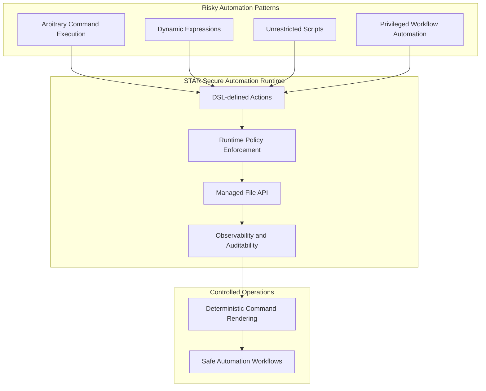
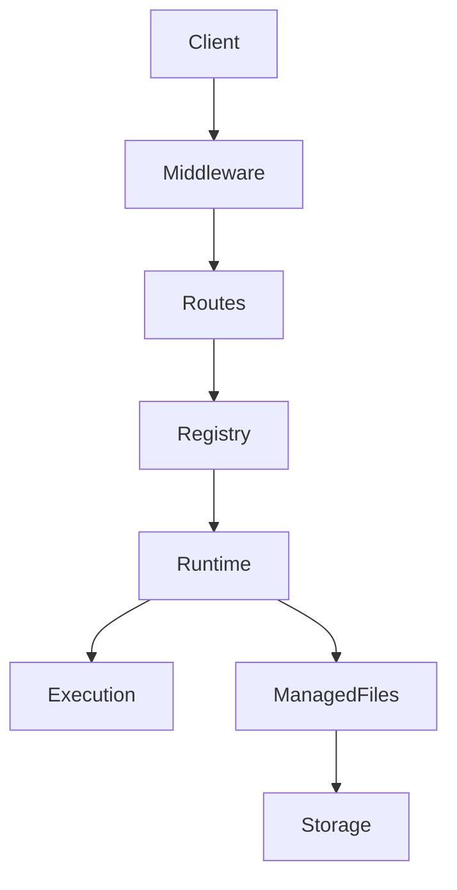
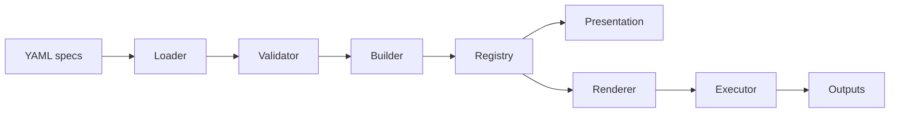
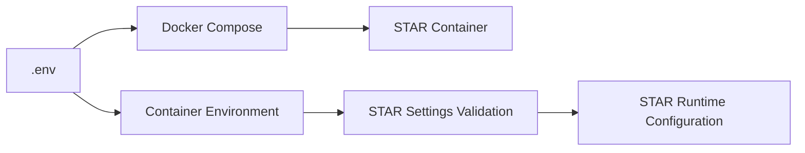

<h1 align="center">STAR - Secure Templated Actions Runtime</h1>

<p align="center">
  Safe actions. No raw shell.
</p>

<p align="center">
  
</p>

<p align="center">
  <em>
    STAR - Secure Templated Actions Runtime - is a secure automation runtime for workflows and AI agents, that replaces abritrary command execution with DSL-defined, templated operations.
  </em>
  <br>
  <em>
    Run predefined actions instead of arbitrary shell commands.
  </em>
</p>

<p align="center">
  <a href="https://github.com/Libertocrat/star/releases">
    
  </a>
  <a href="https://github.com/Libertocrat/star/blob/main/LICENSE">
    
  </a>
  <a href="https://github.com/Libertocrat/star/actions/workflows/ci.yml">
    
  </a>
  <a href="https://github.com/Libertocrat/star/actions/workflows/security.yml">
    
  </a>
  <a href="https://github.com/Libertocrat/star/actions/workflows/release.yml">
    
  </a>
  <a href="https://github.com/Libertocrat/star/pkgs/container/star">
    
  </a>
  <a href="https://www.python.org/">
    
  </a>
  <a href="https://libertocrat.github.io/star/api-docs/">
    
  </a>
</p>

---

## Table of Contents

- [1. Overview](#1-overview)
- [2. Motivation](#2-motivation)
- [3. Key Features](#3-key-features)
- [4. Architecture Overview](#4-architecture-overview)
- [5. Security Model](#5-security-model)
- [6. Quick Start](#6-quick-start)
- [7. Configuration](#7-configuration)
- [8. API Overview](#8-api-overview)
- [9. Observability](#9-observability)
- [10. Project Structure](#10-project-structure)
- [11. Testing Strategy](#11-testing-strategy)
- [12. CI / DevSecOps](#12-ci--devsecops)
- [13. Documentation](#13-documentation)
- [14. Development](#14-development)
- [15. Contributing](#15-contributing)
- [16. Security Reporting](#16-security-reporting)
- [17. License](#17-license)

## 1. Overview

STAR - Secure Templated Actions Runtime - is a secure automation runtime that lets workflows and AI agents run predefined actions instead of arbitrary shell commands.

STAR exposes typed, allow-listed, system-level actions through an authenticated API, together with STAR-managed file lifecycle endpoints.

At startup, STAR loads YAML action definitions, validates them, compiles them into immutable runtime specs, and exposes them through authenticated discovery and execution endpoints at `/v1/actions`. File ingestion, retrieval, listing, download, and deletion are handled through the `/v1/files` API.

In practice, an action is a predefined command template compiled from YAML, not free-form shell submitted by the client. Callers only provide values for the parameters declared by that action.

> [!IMPORTANT]
> STAR is designed for automation systems and AI agent stacks that need controlled execution boundaries.
>
> Several critical Remote Code Execution vulnerabilities discovered in n8n between late 2025 and early 2026 (for example [CVE-2025-68613](https://nvd.nist.gov/vuln/detail/CVE-2025-68613), [CVE-2026-21858](https://nvd.nist.gov/vuln/detail/CVE-2026-21858), and [CVE-2026-21877](https://nvd.nist.gov/vuln/detail/CVE-2026-21877)) highlighted the risks of exposing arbitrary command execution inside automation systems.
>
> STAR addresses this class of problems by replacing free-form command execution with predefined, validated, allow-listed actions and runtime policy checks executed inside a sandboxed environment.

### Execution Boundary Model



### Use Cases

Possible use cases include:

- Secure execution layer for automation platforms such as n8n
- Controlled filesystem operations in microservice architectures
- Secure file-processing runtime inside internal platforms
- Replacement for unsafe command execution patterns in backend services
- Hardened execution boundary for workflow engines and task runners

## 2. Motivation

The rapid adoption of low-code automation platforms, agentic AI systems, and workflow orchestration tools has dramatically increased the number of systems capable of executing complex automated tasks with access to sensitive data and infrastructure.

Many of these platforms prioritize **speed to market and ease of use** over defensive system design. As a result, execution primitives such as command execution, dynamic expressions, or unrestricted scripting frequently become high-risk attack surfaces.

When combined with:

- viral adoption of automation platforms
- widespread self-hosted deployments
- privileged access to internal systems and data
- limited security expertise among many users

these characteristics create a **high-risk environment for Remote Code Execution (RCE), privilege escalation, and data compromise**.

Secure Templated Actions Runtime (STAR) was designed as an **architectural response** to this class of problems.

Instead of exposing arbitrary command execution, STAR introduces a hardened execution boundary where:

- operations are **explicitly allowlisted**
- filesystem access is **sandboxed and constrained**
- execution occurs inside a **rootless container environment**
- APIs enforce **typed request contracts**
- observability enables **traceable and auditable operations**

This model replaces unsafe execution patterns with **controlled, deterministic operations** suitable for automation systems that must balance flexibility with security.

### Example vulnerabilities illustrating the risk

Several critical vulnerabilities discovered in workflow automation platforms between late 2025 and early 2026 illustrate the inherent risk of exposing arbitrary execution capabilities.

| CVE | Type | Description |
| ---- | ---- | ---- |
| [CVE-2025-68613](https://nvd.nist.gov/vuln/detail/CVE-2025-68613) | Authenticated RCE | Expression evaluation flaw allowing code execution inside n8n workflows |
| [CVE-2026-21858](https://nvd.nist.gov/vuln/detail/CVE-2026-21858) | Unauthenticated RCE | "Ni8mare" vulnerability enabling remote takeover via webhook processing |
| [CVE-2026-21877](https://nvd.nist.gov/vuln/detail/CVE-2026-21877) | Authenticated RCE | Unsafe file handling allowing code execution through uploaded content |

> [!WARNING]
> STAR is not a patch for these vulnerabilities.
> It is an architectural approach designed to remove entire classes of unsafe execution patterns from automation workflows.

## 3. Key Features

- DSL-defined action model backed by YAML specs
- Immutable in-memory action registry built at startup from validated specs
- Runtime command rendering with typed params, flags, defaults, and output declarations
- Authenticated action discovery and execution through `/v1/actions`
- API-based file management through `/v1/files`
- STAR-managed file outputs for declared command outputs and optional sanitized stdout materialization via `stdout_as_file`
- Defense-in-depth middleware for auth, request integrity, rate limiting, timeouts, request IDs, and observability
- Runtime-aware OpenAPI generation with per-action examples and public contracts
- Rootless container deployment model
- Automated CI, security scanning, release, and API docs publication workflows

## 4. Architecture Overview

At runtime, requests move through a short and explicit pipeline:



The action system itself is layered:



For a full walkthrough, see [docs/ARCHITECTURE.md](docs/ARCHITECTURE.md).

## 5. Security Model

STAR is designed around explicit controls rather than broad execution capabilities.

- Bearer token authentication on protected endpoints
- Request integrity validation at the ASGI boundary
- Immutable in-memory registry of DSL-defined actions compiled at startup
- Startup validation of DSL action spec files and semantic rules
- Binary allowlisting and blocklisting during action build and execution
- Filesystem storage rooted and sandboxed at `STAR_ROOT_DIR`
- Typed file management via `/v1/files` instead of direct path exposure
- Process-local rate limiting and per-request timeouts
- Request correlation and Prometheus metrics for auditability

An action ultimately becomes subprocess command execution, but only after STAR validates the DSL, validates request params, renders argv deterministically, enforces binary policy, and sanitizes outputs.

For the full threat analysis, see [docs/THREAT_MODEL.md](docs/THREAT_MODEL.md).

## 6. Quick Start

STAR is designed to run inside Docker, stay reachable on the shared Docker network, and be published to localhost by default for local development and demos.

> [!IMPORTANT]
> Before starting the stack, create `secrets/star_api_token.txt` and ensure the external Docker network named by `STAR_SHARED_NETWORK` exists.

Minimal local startup:

```bash
git clone https://github.com/Libertocrat/star.git
cd star

# Create the runtime configuration file from the template
# The ".env" file defines sandbox limits, runtime safeguards,
# and Docker infrastructure parameters used by the STAR container
cp .env.example .env
mkdir -p secrets
openssl rand -hex 32 > secrets/star_api_token.txt

# Replace docker-network if you changed STAR_SHARED_NETWORK in .env
docker network create docker-network || true
docker compose up -d --build
```

Notes:

- by default, `docker-compose.yml` publishes STAR to `127.0.0.1:${STAR_HOST_PORT}`
- runtime configuration is defined by the environment variables set in `.env`
  - check the `.env.example` file for detailed information about env variables
- the container joins the external network defined by `STAR_SHARED_NETWORK`
- internal Docker consumers should use `http://star:${STAR_PORT}`
- the external Docker network must exist before `docker compose up`
- `star-init` prepares ownership and permissions on `STAR_ROOT_DIR` before `star` starts
- the runtime API token is loaded from `secrets/star_api_token.txt` through the Docker secret mount

Useful follow-up checks:

```bash
docker compose ps
docker compose logs -f
```

If host publishing is disabled in Compose and you still need temporary localhost access during development:

```bash
./scripts/star-forward.sh --env-file .env
```

With the default Compose settings, STAR is available at:

- `http://localhost:8080`

Healthcheck:

```bash
curl http://localhost:8080/health
```

OpenAPI docs are disabled by default for security.
Enable `STAR_ENABLE_DOCS=true` only for local development or internal testing.
Never enable docs in production deployments.

When enabled:

- `http://localhost:8080/docs`

To publish STAR on a different host port, set `STAR_HOST_PORT` in `.env` (for example `STAR_HOST_PORT=8090`) and use `http://localhost:8090`.

By default, STAR binds to `127.0.0.1` on the host. To expose it on all host interfaces, set `STAR_HOST_BIND_ADDRESS=0.0.0.0` intentionally and ensure proper network controls.

The local development workflow is documented in [DEVELOPMENT.md](DEVELOPMENT.md).

## 7. Configuration

STAR runtime behavior is configured through environment variables defined in the local `.env` file. Docker Compose reads these variables and injects them into the container environment, where STAR validates and loads its runtime configuration at startup. Review [.env.example](.env.example) for the full documented list and detailed notes for every configurable variable.



Values shown in `.env.example` are placeholder deployment values and do not necessarily represent application defaults or the configuration needed for your particular deployment environment.

### Important variables

| Variable | Description | Default |
| --- | --- | --- |
| `STAR_ROOT_DIR` | Absolute storage root used by STAR for managed blobs and metadata. | `/var/lib/star` |
| `STAR_MAX_FILE_BYTES` | Maximum accepted upload size and file-processing size limit. | `104857600` |
| `STAR_MAX_YML_BYTES` | Maximum size for one DSL spec file. | `102400` |
| `STAR_MAX_STDOUT_BYTES` | Optional max stdout bytes returned from action execution. | unset |
| `STAR_MAX_STDERR_BYTES` | Optional max stderr bytes returned from action execution. | unset |
| `STAR_TIMEOUT_MS` | Per-request timeout in milliseconds. | `5000` |
| `STAR_RATE_LIMIT_RPS` | Process-local requests per second limit. | `10` |
| `STAR_APP_VERSION` | Version exposed by the runtime and OpenAPI metadata. | `0.1.0` |
| `STAR_ENABLE_DOCS` | Enables `/docs`, `/redoc`, and `/openapi.json`. Keep disabled by default for security and enable only for local development or testing. | `false` |
| `STAR_ENABLE_SECURITY_HEADERS` | Enables baseline response security headers. | `true` |
| `STAR_BLOCKED_BINARIES_EXTRA` | Optional CSV of additional blocked binaries. | unset |
| `STAR_CONTAINER_USER` | Build-time container user name for the STAR image. | `star` |
| `STAR_CONTAINER_GROUP` | Build-time container group name for the STAR image. | `star` |
| `STAR_CONTAINER_UID` | Container UID used by the image and `star-init` volume ownership preparation. | `1001` |
| `STAR_CONTAINER_GID` | Container GID used by the image and `star-init` volume ownership preparation. | `1001` |
| `STAR_SHARED_NETWORK` | External Docker network used by the Compose deployment. | `docker-network` |
| `STAR_DATA_VOLUME` | Docker named volume used for STAR persistent data. | `star_star-data` |
| `STAR_HOST_BIND_ADDRESS` | Host interface used by Compose when publishing STAR. | `127.0.0.1` |
| `STAR_HOST_PORT` | Host port used by Compose for localhost access. | `8080` |
| `STAR_PORT` | Internal listen port inside the container (reachable as `http://star:8080`). | `8080` |

> [!IMPORTANT]
> When deploying STAR inside an existing container environment or microservice stack, the following variables should normally be reviewed and adapted before startup:
>
> - `STAR_ROOT_DIR`
> - `STAR_SHARED_NETWORK`
> - `STAR_DATA_VOLUME`
> - `COMPOSE_PROJECT_NAME`
> - `STAR_CONTAINER_UID`
> - `STAR_CONTAINER_GID`
>
> These variables control how STAR integrates with the Docker network, sandbox root, and storage permissions.

The API token is loaded from `/run/secrets/star_api_token`, with `STAR_API_TOKEN_DEV` used only as a development fallback when the Docker secret is missing.

For container identity, runtime limits, and other deployment settings, see the complete reference in [.env.example](.env.example).

## 8. API Overview

STAR exposes a purposely small HTTP surface.

### Action endpoints

- `GET /v1/actions` lists available actions grouped by module, with optional `q`, `tags` (CSV), and `match` (`any`/`all`) filters
- `GET /v1/actions/{action_id}` returns the public contract for one DSL-defined action
- `POST /v1/actions/{action_id}` executes one action with a `params` payload and optional request-level execution options such as `stdout_as_file`

### File endpoints

- `POST /v1/files` uploads and persists a managed file
- `GET /v1/files` lists managed files with cursor pagination and optional filters
- `GET /v1/files/{id}` retrieves metadata by `file_id`
- `GET /v1/files/{id}/content` streams file content
- `DELETE /v1/files/{id}` deletes a managed file

### Public endpoints

- `GET /health`
- `GET /metrics`

Interactive and dynamically generated OpenAPI docs are disabled by default for security. Enable them with `STAR_ENABLE_DOCS=true` only for local development or internal testing:

- `/docs`
- `/redoc`
- `/openapi.json`

Hosted API documentation by release is published at:

- [STAR OpenAPI Docs](https://libertocrat.github.io/star/api-docs)

> [!NOTE]
> This README intentionally does not document the current action catalog. The final public module and action set is still evolving.

## 9. Observability

STAR exports Prometheus-compatible metrics and request correlation metadata.

The `/metrics` endpoint includes request counters, duration histograms, inflight gauges, request integrity rejection counters, rate limit counters, and timeout counters. `X-Request-Id` is propagated or generated on every response.

## 10. Project Structure

The repository is organized around the application package, tests, documentation, and release tooling.

```text
star/
|-- src/
|   `-- star/
|       |-- actions/
|       |   |-- build_engine/    # YAML discovery, validation, and action compilation
|       |   |-- presentation/    # discovery payloads, contracts, and examples
|       |   |-- runtime/         # rendering, execution, sanitization, outputs
|       |   |-- schemas/         # DSL and module schema models
|       |   |-- specs/           # built-in YAML action specs
|       |   `-- registry.py      # immutable runtime registry
|       |-- core/                # config, errors, storage, security, openapi
|       |-- middleware/          # auth, integrity, observability, timeout, etc.
|       |-- routes/              # /v1/actions, /v1/files, /health, /metrics
|       `-- app.py               # FastAPI application factory
|-- tests/                       # smoke, unit, and integration tests
|-- docs/                        # architecture, testing, CI, and threat model docs
|-- scripts/                     # developer and release helper utilities
|-- requirements/                # runtime, testing, linting, security, and dev sets
|-- .github/workflows/           # CI, security, release, and docs publishing
|-- docker-compose.yml           # local container stack
|-- Dockerfile                   # container image build
|-- .env.example                 # runtime configuration template
`-- Makefile                     # local quality and security workflow entry point
```

## 11. Testing Strategy

The test suite combines smoke tests, unit tests, and integration tests.

Current coverage includes:

- DSL loader, validator, and builder behavior
- public action catalog, contracts, and serializers
- runtime renderer, executor, sanitizer, and output builders
- file upload, listing, metadata, download, and delete behavior
- settings validation and OpenAPI generation
- middleware enforcement and security-sensitive HTTP validation

For full test details, see [docs/TESTING.md](docs/TESTING.md).

## 12. CI / DevSecOps

STAR uses GitHub Actions plus a Makefile-driven local workflow for repeatable quality and security checks.

The repository includes these workflows:

- [CI quality gate](.github/workflows/ci.yml)
- [deep security workflow](.github/workflows/security.yml)
- [container release pipeline](.github/workflows/release.yml)
- [versioned API docs publishing pipeline](.github/workflows/release-docs.yml)

For details, see [docs/CI.md](docs/CI.md).

## 13. Documentation

Detailed design and workflow material lives in:

| Document | Description |
| --- | --- |
| [docs/ARCHITECTURE.md](docs/ARCHITECTURE.md) | System architecture, DSL action pipeline, runtime execution, and OpenAPI design |
| [docs/THREAT_MODEL.md](docs/THREAT_MODEL.md) | Threat model, trust boundaries, and mitigations |
| [docs/TESTING.md](docs/TESTING.md) | Testing strategy, fixtures, and local execution |
| [docs/CI.md](docs/CI.md) | CI, security scanning, release, and docs publication workflows |
| [DEVELOPMENT.md](DEVELOPMENT.md) | Local development environment and Makefile workflow |
| [CONTRIBUTING.md](CONTRIBUTING.md) | Current contribution policy |
| [SECURITY.md](SECURITY.md) | Vulnerability disclosure policy |
| [scripts/README.md](scripts/README.md) | Developer and release helper scripts |

## 14. Development

Local development is documented in [DEVELOPMENT.md](DEVELOPMENT.md).

The main workflow is:

- define or edit DSL specs under `src/star/actions/specs`
- run the container stack with Docker Compose
- validate behavior through tests and the authenticated action endpoints
- export and publish OpenAPI docs through the provided scripts and workflows

## 15. Contributing

External pull requests are currently paused while the project stabilizes its public API, security model, testing surface, and release process.

For the current policy, see [CONTRIBUTING.md](CONTRIBUTING.md).

## 16. Security Reporting

Do not report vulnerabilities in public issues.

Use the coordinated disclosure process documented in [SECURITY.md](SECURITY.md). For encrypted reporting, the repository includes [SECURITY_PGP_KEY.asc](SECURITY_PGP_KEY.asc).

## 17. License

STAR is licensed under the Apache License 2.0. See [LICENSE](LICENSE) for the full text.

---
