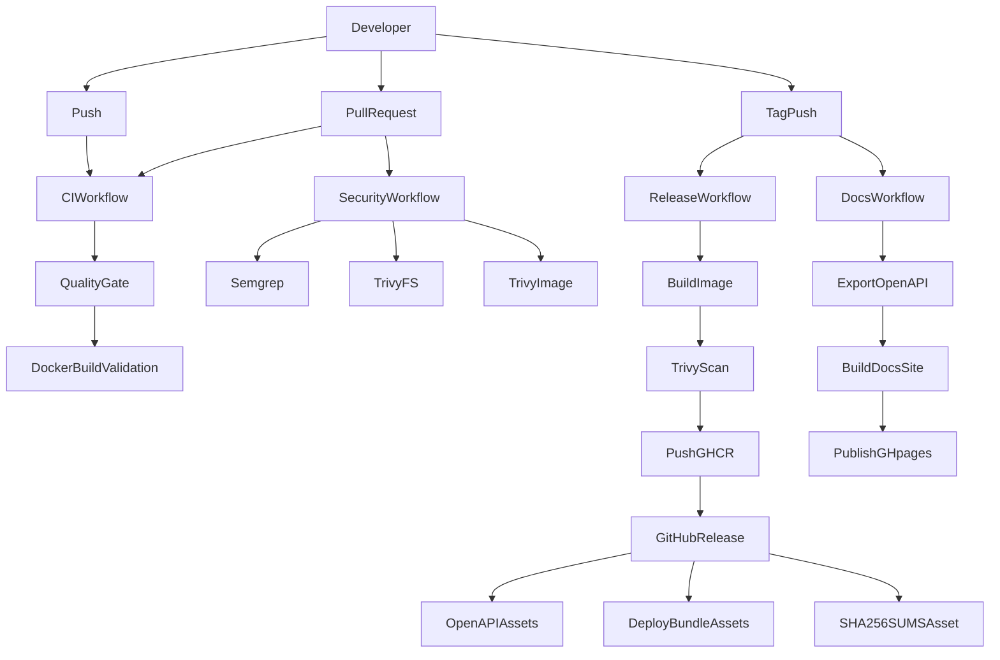
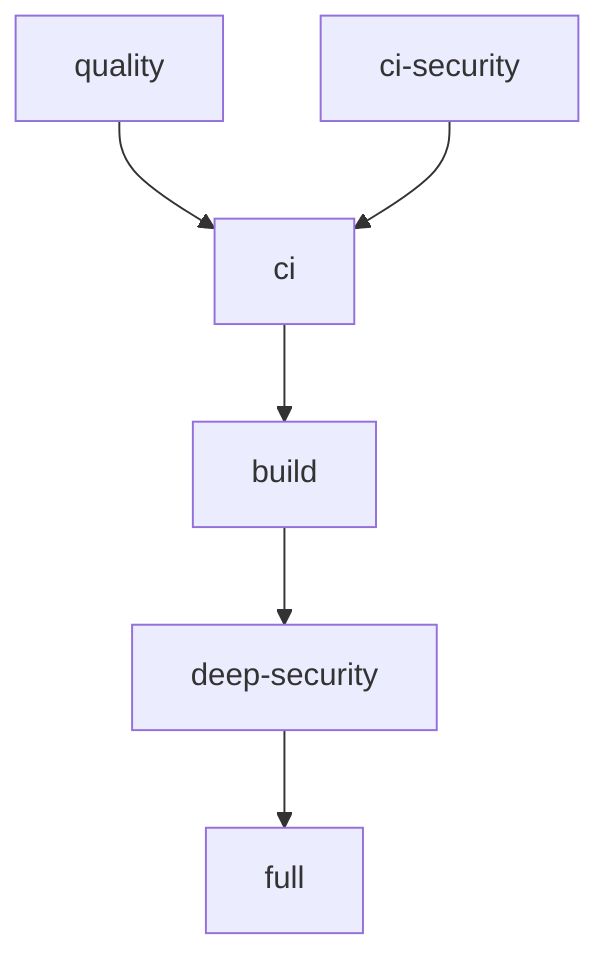
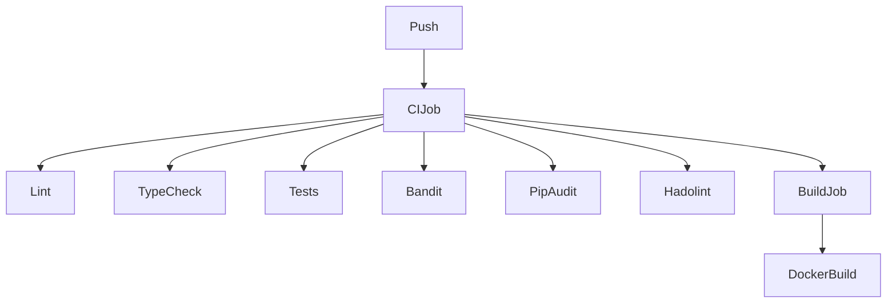
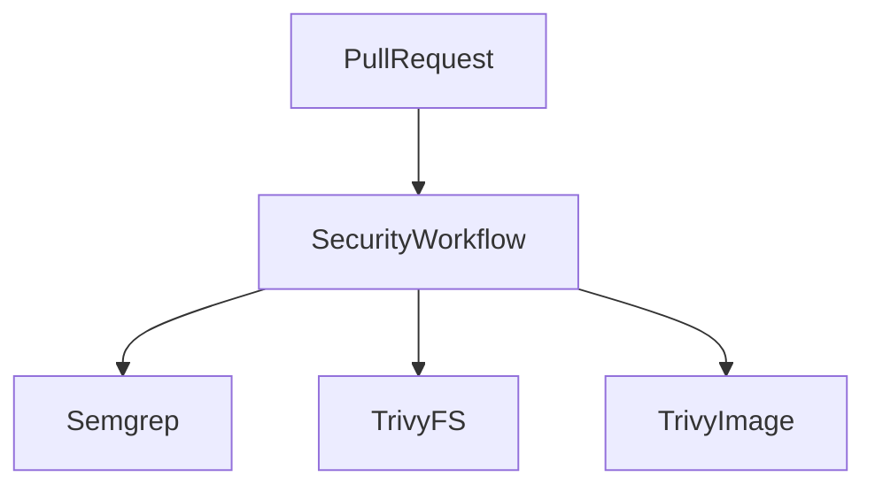
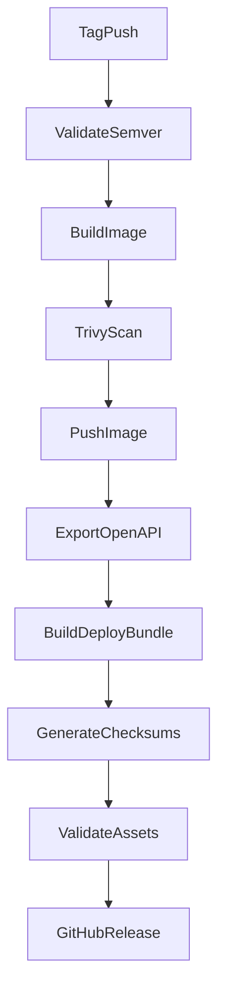
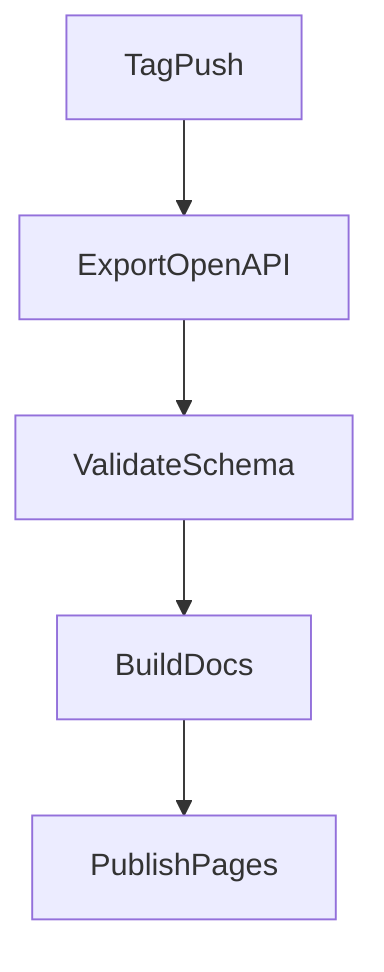

# STAR CI and Release Pipelines

  
  
  
  
  
  
  
  
  
  
  
  

 

## Table of Contents

- [1. CI Overview](#1-ci-overview)
- [2. CI Architecture](#2-ci-architecture)
- [3. Makefile-Driven CI Pipeline](#3-makefile-driven-ci-pipeline)
- [4. Dependency Management](#4-dependency-management)
- [5. Quality Gate Pipeline (ci.yml)](#5-quality-gate-pipeline-ciyml)
- [6. Security Analysis Pipeline (security.yml)](#6-security-analysis-pipeline-securityyml)
- [7. Release Pipeline (release.yml)](#7-release-pipeline-releaseyml)
- [8. Documentation Publishing Pipeline (release-docs.yml)](#8-documentation-publishing-pipeline-release-docsyml)
- [9. Pre-commit Integration](#9-pre-commit-integration)

## 1. CI Overview

STAR uses GitHub Actions workflows stored in `.github/workflows/` together with a Makefile-driven execution model.

The CI system enforces:

- code quality
- type safety
- automated testing
- security scanning
- container build validation
- automated releases and image publishing to GHCR.io
- documentation publication

The Makefile is the main orchestration layer for repeatable local and CI execution. GitHub Actions jobs install the required tooling and then call Makefile targets for the quality gate, baseline security checks, and the deeper Trivy scans.

## 2. CI Architecture

GitHub Actions orchestrates the repository pipeline through four workflow files in `.github/workflows/`.

| Workflow | Purpose |
| --- | --- |
| `ci.yml` | Fast quality gate and Docker build validation |
| `security.yml` | Deep security analysis with Semgrep and Trivy |
| `release.yml` | Container release to GHCR, OpenAPI export, deploy bundle packaging, checksums generation, and GitHub release assets |
| `release-docs.yml` | OpenAPI export, versioned docs site build, and publication to `gh-pages` |

At a high level:

- `ci.yml` runs on pushes to `main`, `feat/**`, and `feature/**`, on pull requests to `main`, and on manual dispatch
- `security.yml` runs on pull requests to `main`, on a weekly schedule, and on manual dispatch
- `release.yml` runs on version tag pushes matching `v*` and on manual dispatch
- `release-docs.yml` runs on version tag pushes matching `v*`

This separation keeps fast feedback, deep security analysis, release automation, and documentation publishing in distinct pipelines.

## 3. Makefile-Driven CI Pipeline

The `Makefile` defines the executable CI tasks and their composition.

Important aggregate targets are:

- `quality` - runs `lint`, `typecheck`, and `test`
- `ci-security` - runs `bandit`, `pip-audit`, and `hadolint`
- `ci` - combines `quality` and `ci-security`
- `build` - builds the Docker image locally with `docker build`
- `deep-security` - runs `semgrep`, `trivy-fs`, and `trivy-image`
- `full` - runs `ci`, `build`, and `deep-security`

Supporting targets provide the actual commands:

- `lint` runs `lint-shell`, `lint-actions`, `black --check`, and `ruff check`
- `fmt-shell` runs `shfmt -w -i 4 -ci -sr` across repository shell scripts
- `lint-shell-format` runs `shfmt -d -i 4 -ci -sr` across repository shell scripts
- `lint-shell` runs shell formatting validation through `lint-shell-format` and then `shellcheck -x`
- `lint-actions` runs `actionlint` for `.github/workflows/`
- `typecheck` runs `mypy --config-file mypy.ini`
- `test` runs `pytest -q tests`
- `bandit` scans `src/`
- `pip-audit` audits `requirements/runtime.txt`
- `hadolint` checks `Dockerfile`
- `semgrep` runs `semgrep scan`
- `trivy-fs` scans the repository filesystem for secrets and misconfigurations
- `trivy-image` builds and scans the local image for vulnerabilities

## 4. Dependency Management

Python dependencies are split across the `requirements/` directory.

| File | Purpose |
| --- | --- |
| `runtime.txt` | Runtime packages required to run the STAR API service |
| `testing.txt` | Test and quality execution packages such as `pytest`, `pytest-asyncio`, and `openapi-spec-validator` |
| `linting.txt` | Formatting, linting, typing, and pre-commit tools such as Black, Ruff, MyPy, and pre-commit |
| `security.txt` | Security scanning tools such as Bandit and pip-audit |
| `dev.txt` | Aggregates `runtime.txt`, `testing.txt`, `linting.txt`, and `security.txt` |

`dev.txt` is the full local development set:

- `-r runtime.txt`
- `-r testing.txt`
- `-r linting.txt`
- `-r security.txt`

Workflows install different dependency sets depending on their job:

- `ci.yml` installs `requirements/dev.txt` and sets up Go to build `actionlint`
- `security.yml` installs `requirements/runtime.txt` and `requirements/security.txt`
- `release.yml` installs `requirements/runtime.txt`, `requirements/testing.txt`, and the editable project for OpenAPI export
- `release-docs.yml` installs `requirements/runtime.txt`, `requirements/testing.txt`, and the editable project for docs generation

## 5. Quality Gate Pipeline (ci.yml)

The workflow in `.github/workflows/ci.yml` is the main fast feedback pipeline.

It has two jobs.

### `ci` job

The `ci` job performs these steps:

- checks out the repository
- sets up Python 3.12
- sets up Go 1.25.x
- caches pip downloads using `hashFiles('requirements/**/*.txt')`
- installs the Hadolint binary
- installs `shellcheck` and `shfmt`
- installs `actionlint` with `go install github.com/rhysd/actionlint/cmd/actionlint@v1.7.12`
- creates a `.venv` virtual environment
- installs `requirements/dev.txt`
- runs `make ci`

`make ci` expands to:

- `quality`
- `ci-security`

That includes:

- shell formatting validation for shell scripts through `shfmt -d -i 4 -ci -sr $(SHELL_FILES)`
- ShellCheck checks for shell scripts through `shellcheck -x $(SHELL_FILES)`
- actionlint checks for GitHub Actions workflows through `actionlint`
- Black formatting checks through `black --check`
- Ruff linting through `ruff check`
- MyPy type checking through `mypy`
- pytest execution through `pytest -q tests`
- Bandit SAST through `bandit`
- pip-audit dependency scanning against `requirements/runtime.txt`
- Hadolint checks for `Dockerfile`

### `build` job

The `build` job runs after the `ci` job completes successfully.

It performs:

- repository checkout
- Docker Buildx setup
- Docker image build validation with `docker/build-push-action@v5`
- GitHub Actions cache reuse through `cache-from` and `cache-to`

The image is built for `linux/amd64` with `push: false`. This job validates that the container image can be built reproducibly after the source-level quality gate passes.

## 6. Security Analysis Pipeline (security.yml)

The workflow in `.github/workflows/security.yml` is the deeper security pipeline.

Triggers are:

- pull requests to `main`
- a weekly cron schedule at `0 3 * * 1`
- manual workflow execution

The workflow installs Python 3.12, caches pip downloads, creates a virtual environment, and installs:

- `requirements/runtime.txt`
- `requirements/security.txt`

It then runs three security stages. Semgrep is invoked directly through the GitHub Action, while the Trivy stages remain Makefile-driven through `make trivy-fs` and `make trivy-image`.

### Semgrep SAST

Semgrep is executed with `returntocorp/semgrep-action@v1` using these rule sets:

- `p/ci`
- `p/python`
- `p/security-audit`

### Trivy filesystem scan

The workflow installs Trivy and `jq`, then runs:

- `make trivy-fs`

The Makefile target runs Trivy in filesystem mode with:

- `--scanners secret,misconfig`
- `--severity HIGH,CRITICAL`
- JSON output parsed by `jq`

The target fails unless HIGH misconfigurations, CRITICAL misconfigurations, and detected secrets are all zero.

### Trivy image scan

The workflow runs:

- `make trivy-image IMAGE_NAME=star IMAGE_TAG=${GITHUB_SHA}`

The Makefile target first builds the image through the `build` dependency, then runs Trivy in image mode with:

- `--scanners vuln`
- `--severity HIGH,CRITICAL`
- `--ignore-unfixed`

The target fails unless both HIGH and CRITICAL vulnerability counts are zero.

## 7. Release Pipeline (release.yml)

The workflow in `.github/workflows/release.yml` automates container releases and GitHub release assets.

> [!IMPORTANT]
> Publishing is reserved for version tags matching `v*`. Regular pushes and pull requests do not publish container images or GitHub release artifacts.

It is triggered by:

- pushes of tags matching `v*`
- manual workflow dispatch

The release job performs these stages:

1. Checkout with full history
2. Normalize image owner and image name to lowercase
3. Enable Docker Buildx
4. Validate strict semantic version format `vX.Y.Z`
5. Derive `APP_VERSION` from the tag
6. Log in to GHCR
7. Generate Docker metadata tags
8. Build the image locally with Buildx and GitHub cache reuse
9. Install Trivy and scan the release image before publishing
10. Push the generated tags to GHCR
11. Install release tooling required for archive packaging (`zip`)
12. Install Python dependencies for OpenAPI export
13. Export the OpenAPI schema by running `scripts/export_openapi.py` with `STAR_DOCS_ROOT_DIR` set to a writable runner temporary path
14. Prepare OpenAPI release files in `dist/` (`openapi.json` and `openapi-vX.Y.Z.json`)
15. Build deploy bundle archives from `deploy/` with `star-deploy/` as archive root
16. Generate `SHA256SUMS` for OpenAPI and deploy bundle artifacts
17. Validate release assets and archive structure before upload
18. Create a GitHub release and upload release assets

Docker metadata is generated by `docker/metadata-action@v5` and includes:

- raw semantic version
- normalized semantic version
- major.minor version
- major version
- short commit SHA
- `latest`

The workflow publishes images to `ghcr.io/<owner>/<image>`.

Release assets include:

- `dist/openapi.json`
- `dist/openapi-vX.Y.Z.json`
- `dist/star-deploy-vX.Y.Z.tar.gz`
- `dist/star-deploy-vX.Y.Z.zip`
- `dist/star-deploy.tar.gz`
- `dist/star-deploy.zip`
- `dist/SHA256SUMS`

The non-versioned deploy bundle files (`star-deploy.tar.gz` and `star-deploy.zip`) are intentionally published to support a stable latest-release download URL.

These OpenAPI artifacts are generated from the live FastAPI app and the runtime action registry built from validated DSL YAML specs.

This means the release pipeline publishes container artifacts, API contract artifacts, an installable deploy runtime bundle, and release checksums.

## 8. Documentation Publishing Pipeline (release-docs.yml)

The workflow in `.github/workflows/release-docs.yml` publishes versioned API documentation to the `gh-pages` branch.

> [!NOTE]
> The docs publishing workflow adds new versioned content without removing previously published API documentation versions.

It is triggered by pushes of tags matching `v*`.

The workflow performs these stages:

1. Checkout the repository
2. Validate strict semantic version format `vX.Y.Z`
3. Set up Python 3.12 and cache pip downloads
4. Install runtime and testing dependencies and the editable project
5. Export the OpenAPI schema with `scripts/export_openapi.py` while setting `STAR_DOCS_ROOT_DIR` to a writable runner temporary path
6. Validate the exported schema with `openapi_spec_validator`
7. Set up Node.js 20
8. Install `swagger-ui-dist@5.17.14`
9. Build the versioned docs site with `scripts/build_docs_site.py`
10. Check out the `gh-pages` branch
11. Copy the generated `site/` content into the publishing branch
12. Commit and push the update

The Python helper scripts do the actual documentation build work:

- `scripts/export_openapi.py` builds the FastAPI app with documentation settings, initializes the DSL-backed runtime registry, and writes `docs/api-docs/output/openapi.json`
- `scripts/build_docs_site.py` creates `site/api-docs/<version>/`, copies Swagger UI assets, writes `index.html`, copies `openapi.json`, and creates redirect pages

The published site contains:

- versioned API documentation under `api-docs/<version>/`
- the exported OpenAPI schema
- a Swagger UI based interface

The workflow publishes without deleting previous versions. It copies the generated site into `gh-pages` and commits only when there are changes.

## 9. Pre-commit Integration

Local quality enforcement is configured in `.pre-commit-config.yaml`.

Configured hooks include:

- `trailing-whitespace`
- `end-of-file-fixer`
- `check-yaml`
- Black
- Ruff with `--fix`
- `shfmt` for shell script formatting
- `shellcheck` for shell script linting
- MyPy for `src` and `tests`
- Bandit for `src`
- Hadolint for `Dockerfile`
- pytest for `tests`

The MyPy hook includes additional dependencies so type checking can run inside the isolated pre-commit environment. Local hooks are also used for shfmt, ShellCheck, Hadolint, and pytest.

These hooks mirror the main quality checks used by the repository:

- formatting and linting
- static typing
- security scanning with Bandit
- Dockerfile validation
- test execution

They provide local enforcement before changes reach GitHub Actions.

---
