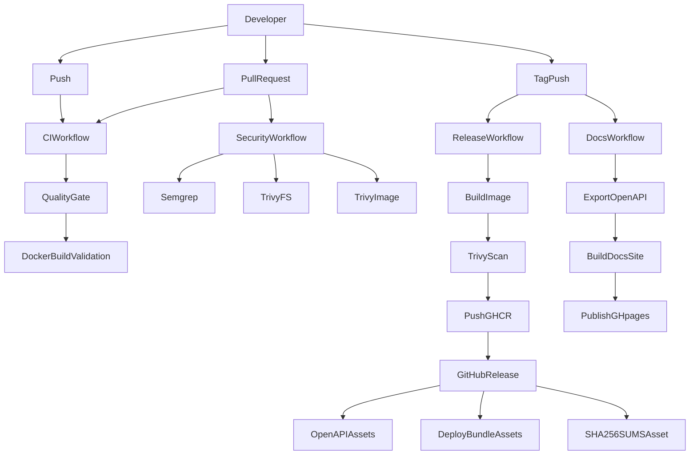
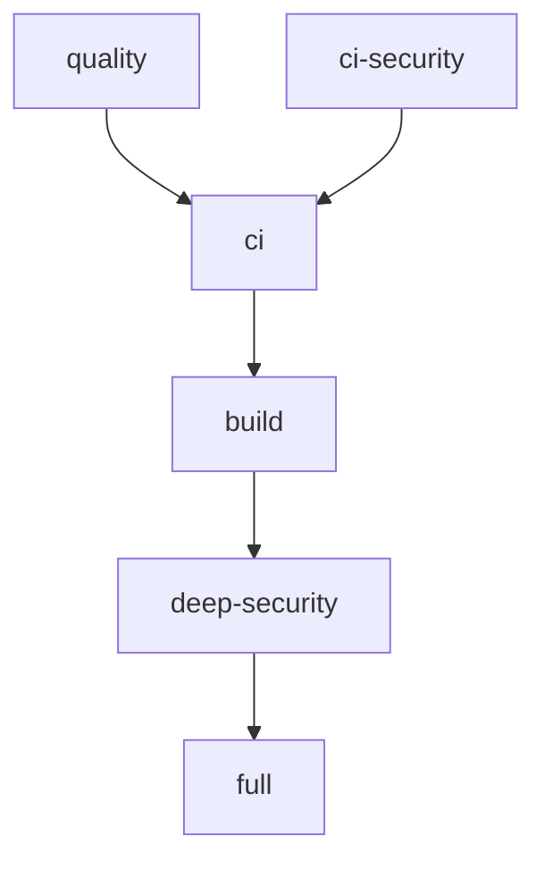
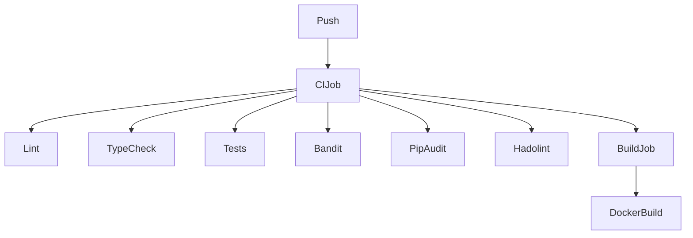
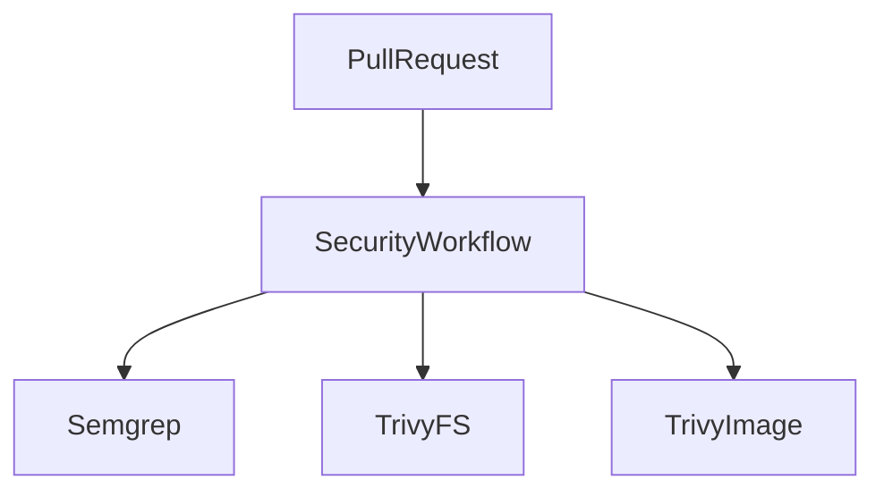
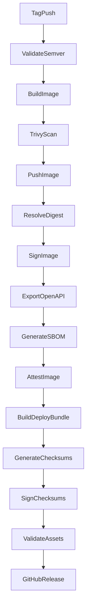
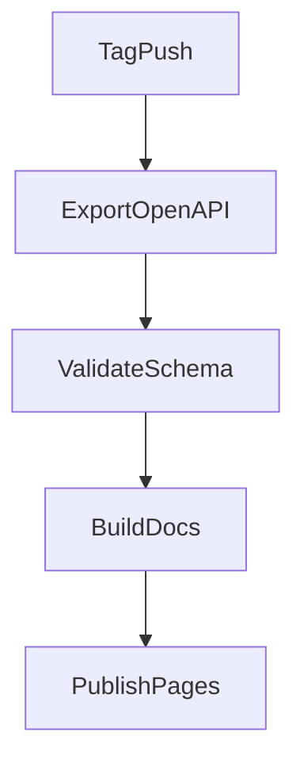

# STAR CI and Release Pipelines

  
  
  
  
  
  
  
  
  
  
  
  

 

## Table of Contents

- [1. CI Overview](#1-ci-overview)
- [2. CI Architecture](#2-ci-architecture)
- [3. Makefile-Driven CI Pipeline](#3-makefile-driven-ci-pipeline)
- [4. Dependency Management](#4-dependency-management)
- [5. Quality Gate Pipeline (ci.yml)](#5-quality-gate-pipeline-ciyml)
- [6. Security Analysis Pipeline (security.yml)](#6-security-analysis-pipeline-securityyml)
- [7. Release Pipeline (release.yml)](#7-release-pipeline-releaseyml)
- [8. Documentation Publishing Pipeline (release-docs.yml)](#8-documentation-publishing-pipeline-release-docsyml)
- [9. Release Smoke Test (release-smoke-test.yml)](#9-release-smoke-test-release-smoke-testyml)
- [10. Pre-commit Integration](#10-pre-commit-integration)

## 1. CI Overview

STAR uses GitHub Actions workflows stored in `.github/workflows/` together with a Makefile-driven execution model.

The CI system enforces:

- code quality
- type safety
- automated testing
- security scanning
- container build validation
- automated releases and image publishing to GHCR.io
- documentation publication

The Makefile is the main orchestration layer for repeatable local and CI execution. GitHub Actions jobs install the required tooling and then call Makefile targets for the quality gate, baseline security checks, and the deeper Trivy scans.

```mermaid
flowchart TD

Developer --> Push
Developer --> PullRequest
Developer --> TagPush

Push --> CIWorkflow
PullRequest --> CIWorkflow
PullRequest --> SecurityWorkflow

TagPush --> ReleaseWorkflow
TagPush --> DocsWorkflow

CIWorkflow --> QualityGate
QualityGate --> DockerBuildValidation

SecurityWorkflow --> Semgrep
SecurityWorkflow --> TrivyFS
SecurityWorkflow --> TrivyImage

ReleaseWorkflow --> BuildImage
BuildImage --> TrivyScan
TrivyScan --> PushGHCR
PushGHCR --> GitHubRelease
GitHubRelease --> OpenAPIAssets
GitHubRelease --> DeployBundleAssets
GitHubRelease --> SHA256SUMSAsset

DocsWorkflow --> ExportOpenAPI
ExportOpenAPI --> BuildDocsSite
BuildDocsSite --> PublishGHpages
```

## 2. CI Architecture

GitHub Actions orchestrates the repository pipeline through five workflow files in `.github/workflows/` and two local core actions.

| Workflow | Purpose |
| --- | --- |
| `ci.yml` | Fast quality gate and Docker build validation |
| `security.yml` | Deep security analysis with Semgrep and Trivy |
| `release.yml` | Container release to GHCR, OpenAPI export, deploy bundle packaging, checksums generation, and GitHub release assets |
| `release-docs.yml` | OpenAPI export, versioned docs site build, and publication to `gh-pages` |
| `release-smoke-test.yml` | Protected pre-merge release and docs publication smoke test using private test destinations |

At a high level:

- `ci.yml` runs on pushes to `main`, `feat/**`, and `feature/**`, on pull requests to `main`, and on manual dispatch
- `security.yml` runs on pull requests to `main`, on a weekly schedule, and on manual dispatch
- `release.yml` runs on version tag pushes matching `v*` and on manual dispatch; it only publishes when the selected ref is a strict SemVer tag whose target commit is reachable from the repository default branch
- `release-docs.yml` runs on version tag pushes matching `v*`; it applies the same eligibility check before generating or publishing documentation
- `release-smoke-test.yml` runs only on pushes to `test/smoke-release-**`; its publication job waits for the protected `release-smoke` environment and its docs job never publishes `gh-pages`

`release.yml` and `release-docs.yml` delegate shared stages to local composite actions, keeping their production triggers independent while preventing stage drift. This separation keeps fast feedback, deep security analysis, release automation, documentation publishing, and pre-merge smoke validation in distinct pipelines.

## 3. Makefile-Driven CI Pipeline

The `Makefile` defines the executable CI tasks and their composition.

Important aggregate targets are:

- `quality` - runs `lint`, `typecheck`, and `test`
- `ci-security` - runs `bandit`, `pip-audit`, and `hadolint`
- `ci` - combines `quality` and `ci-security`
- `build` - builds the Docker image locally with `docker build`
- `build-pull` - builds the Docker image after checking its remote base image
- `deep-security` - runs `semgrep`, `trivy-fs`, and `trivy-image`
- `deep-security-pull` - runs deep security checks against an image built with a freshly pulled base
- `full` - runs `ci`, `build`, and `deep-security`
- `full-pull` - runs `ci`, `build-pull`, and `deep-security-pull`

Supporting targets provide the actual commands:

- `lint` runs `lint-shell`, `lint-actions`, `black --check`, and `ruff check`
- `fmt-shell` runs `shfmt -w -i 4 -ci -sr` across repository shell scripts
- `lint-shell-format` runs `shfmt -d -i 4 -ci -sr` across repository shell scripts
- `lint-shell` runs shell formatting validation through `lint-shell-format` and then `shellcheck -x`
- `lint-actions` runs `actionlint` for `.github/workflows/`
- `typecheck` runs `mypy --config-file mypy.ini`
- `test` runs `pytest -q tests`
- `bandit` scans `src/`
- `pip-audit` audits `requirements/runtime.txt`
- `hadolint` checks `Dockerfile`
- `semgrep` runs `semgrep scan`
- `trivy-fs` scans the repository filesystem for secrets and misconfigurations
- `trivy-image` builds and scans the local image for vulnerabilities
- `trivy-image-pull` builds with `--pull` and scans the resulting local image for vulnerabilities

```mermaid
flowchart TD
quality --> ci
ci-security --> ci
ci --> build
build --> deep-security
deep-security --> full
```

## 4. Dependency Management

Python dependencies are split across the `requirements/` directory.

| File | Purpose |
| --- | --- |
| `runtime.txt` | Runtime packages required to run the STAR API service |
| `testing.txt` | Test and quality execution packages such as `pytest`, `pytest-asyncio`, and `openapi-spec-validator` |
| `linting.txt` | Formatting, linting, typing, and pre-commit tools such as Black, Ruff, MyPy, and pre-commit |
| `security.txt` | Security scanning tools such as Bandit and pip-audit |
| `dev.txt` | Aggregates `runtime.txt`, `testing.txt`, `linting.txt`, and `security.txt` |

`dev.txt` is the full local development set:

- `-r runtime.txt`
- `-r testing.txt`
- `-r linting.txt`
- `-r security.txt`

Workflows install different dependency sets depending on their job:

- `ci.yml` installs `requirements/dev.txt` and sets up Go to build `actionlint`
- `security.yml` installs `requirements/runtime.txt` and `requirements/security.txt`
- `release.yml` installs `requirements/runtime.txt`, `requirements/testing.txt`, and the editable project for OpenAPI export
- `release-docs.yml` installs `requirements/runtime.txt`, `requirements/testing.txt`, and the editable project for docs generation

## 5. Quality Gate Pipeline (ci.yml)

The workflow in `.github/workflows/ci.yml` is the main fast feedback pipeline.

It has two jobs.

### `ci` job

The `ci` job performs these steps:

- checks out the repository
- sets up Python 3.12
- sets up Go 1.25.x
- caches pip downloads using `hashFiles('requirements/**/*.txt')`
- installs the Hadolint binary
- installs `shellcheck` and `shfmt`
- installs `actionlint` with `go install github.com/rhysd/actionlint/cmd/actionlint@v1.7.12`
- creates a `.venv` virtual environment
- installs `requirements/dev.txt`
- runs `make ci`

`make ci` expands to:

- `quality`
- `ci-security`

That includes:

- shell formatting validation for shell scripts through `shfmt -d -i 4 -ci -sr $(SHELL_FILES)`
- ShellCheck checks for shell scripts through `shellcheck -x $(SHELL_FILES)`
- actionlint checks for GitHub Actions workflows through `actionlint`
- Black formatting checks through `black --check`
- Ruff linting through `ruff check`
- MyPy type checking through `mypy`
- pytest execution through `pytest -q tests`
- Bandit SAST through `bandit`
- pip-audit dependency scanning against `requirements/runtime.txt`
- Hadolint checks for `Dockerfile`

### `build` job

The `build` job runs after the `ci` job completes successfully.

It performs:

- repository checkout
- Docker Buildx setup
- Docker image build validation with `docker/build-push-action@v5`
- GitHub Actions cache reuse through `cache-from` and `cache-to`

The image is built for `linux/amd64` with `push: false`. This job validates that the container image can be built reproducibly after the source-level quality gate passes.

```mermaid
flowchart TD
Push --> CIJob
CIJob --> Lint
CIJob --> TypeCheck
CIJob --> Tests
CIJob --> Bandit
CIJob --> PipAudit
CIJob --> Hadolint
CIJob --> BuildJob
BuildJob --> DockerBuild
```

## 6. Security Analysis Pipeline (security.yml)

The workflow in `.github/workflows/security.yml` is the deeper security pipeline.

Triggers are:

- pull requests to `main`
- a weekly cron schedule at `0 3 * * 1`
- manual workflow execution

The workflow installs Python 3.12, caches pip downloads, creates a virtual environment, and installs:

- `requirements/runtime.txt`
- `requirements/security.txt`

It then runs three security stages. Semgrep and Trivy remain Makefile-driven through `make semgrep`, `make trivy-fs`, and `make trivy-image`.

### Semgrep SAST

Semgrep is executed through `make semgrep` using these rule sets:

- `p/ci`
- `p/python`
- `p/security-audit`

The blocking Semgrep gate excludes `yaml.github-actions.security.github-actions-mutable-action-tag.github-actions-mutable-action-tag`.
STAR treats mutable GitHub Actions major tags as hardening work rather than a release-blocking Semgrep finding because the workflow policy currently allows reviewed stable major versions.

### Trivy filesystem scan

The workflow installs Trivy and `jq`, then runs:

- `make trivy-fs`

The Makefile target runs Trivy in filesystem mode with:

- `--scanners secret,misconfig`
- `--severity HIGH,CRITICAL`
- JSON output parsed by `jq`

The target fails unless HIGH misconfigurations, CRITICAL misconfigurations, and detected secrets are all zero.

### Trivy image scan

The workflow runs:

- `make trivy-image IMAGE_NAME=star IMAGE_TAG=${GITHUB_SHA}`

The Makefile target first builds the image through the `build` dependency, then runs Trivy in image mode with:

- `--scanners vuln`
- `--severity HIGH,CRITICAL`
- `--ignore-unfixed`

The target fails unless both HIGH and CRITICAL vulnerability counts are zero.

```mermaid
flowchart TD
PullRequest --> SecurityWorkflow
SecurityWorkflow --> Semgrep
SecurityWorkflow --> TrivyFS
SecurityWorkflow --> TrivyImage
```

## 7. Release Pipeline (release.yml)

The workflow in `.github/workflows/release.yml` is the production wrapper for the local `release-core` action, which automates container releases and GitHub release assets.

> [!IMPORTANT]
> Publishing is reserved for version tags matching `v*`. Regular pushes and pull requests do not publish container images or GitHub release artifacts.

It is triggered by:

- pushes of tags matching `v*`
- manual workflow dispatch

The release job checks out the tagged source, then delegates the remaining stages to the local `release-core` action:

1. Checkout the tagged source with full history
2. Verify strict `vX.Y.Z` eligibility and default-branch ancestry before any registry login or dependency installation
3. Normalize image metadata and derive `APP_VERSION`
4. Enable Docker Buildx and log in to GHCR
5. Generate Docker metadata and build the `linux/amd64` image locally with GitHub cache reuse after pulling its current base image
6. Install Trivy and block publication when the local image has HIGH or CRITICAL vulnerabilities
7. Push the generated tags to GHCR, resolve the immutable digest for the version tag, and fail unless every generated tag resolves to that digest
8. Sign the published image digest with keyless Cosign using GitHub OIDC
9. Install archive and OpenAPI tooling, then export OpenAPI with `STAR_DOCS_ROOT_DIR` set to a writable runner temporary path
10. Generate the SPDX SBOM, provenance/SBOM attestations, deploy archives, checksums, and the signed checksum bundle
11. Validate archive structure, checksum coverage, checksums, and the signed checksum manifest before upload
12. Create the GitHub release and upload release assets

Docker metadata is generated by `docker/metadata-action@v5` and includes:

- raw semantic version
- normalized semantic version
- major.minor version
- major version
- short commit SHA
- `latest`

The workflow publishes images to `ghcr.io/<owner>/<image>`.

The release core uses `pull: true` so its Trivy scan evaluates an image built from the current remote base. Local `*-pull` targets reproduce that release-adjacent condition; the regular local targets and CI build validation remain cache-oriented.

Release assets include:

- `dist/openapi.json`
- `dist/openapi-vX.Y.Z.json`
- `dist/star-image-vX.Y.Z.spdx.json`
- `dist/star-deploy-vX.Y.Z.tar.gz`
- `dist/star-deploy-vX.Y.Z.zip`
- `dist/star-deploy.tar.gz`
- `dist/star-deploy.zip`
- `dist/SHA256SUMS`
- `dist/SHA256SUMS.sigstore.json`

The workflow stores provenance and SPDX SBOM attestations with the image digest in GitHub and GHCR. The downloaded SBOM is covered by the signed checksum manifest. Consumers can verify image provenance with `gh attestation verify` and use Cosign to verify the image digest or `SHA256SUMS` bundle.

The non-versioned deploy bundle files (`star-deploy.tar.gz` and `star-deploy.zip`) are intentionally published to support a stable latest-release download URL.

Each release deploy bundle embeds its release tag so its generated runtime configuration selects the matching image by default.

These OpenAPI artifacts are generated from the live FastAPI app and the runtime action registry built from validated DSL YAML specs.

This means the release pipeline publishes container artifacts, API contract artifacts, an installable deploy runtime bundle, and release checksums.

```mermaid
flowchart TD
TagPush --> ValidateSemver
ValidateSemver --> BuildImage
BuildImage --> TrivyScan
TrivyScan --> PushImage
PushImage --> ResolveDigest
ResolveDigest --> SignImage
SignImage --> ExportOpenAPI
ExportOpenAPI --> GenerateSBOM
GenerateSBOM --> AttestImage
AttestImage --> BuildDeployBundle
BuildDeployBundle --> GenerateChecksums
GenerateChecksums --> SignChecksums
SignChecksums --> ValidateAssets
ValidateAssets --> GitHubRelease
```

## 8. Documentation Publishing Pipeline (release-docs.yml)

The workflow in `.github/workflows/release-docs.yml` is the production wrapper for the local `release-docs-core` action, which publishes versioned API documentation to the `gh-pages` branch.

> [!NOTE]
> The docs publishing workflow adds new versioned content without removing previously published API documentation versions.

It is triggered by pushes of tags matching `v*`. Before any dependency installation or publication, it requires a strict `vX.Y.Z` tag whose target commit is reachable from the repository default branch. This prevents tags created from feature or smoke branches from modifying `gh-pages`.

The workflow performs these stages:

1. Checkout the release tag
2. Verify that the ref is a strict `vX.Y.Z` tag integrated into the repository default branch
3. Set up Python 3.12 and cache pip downloads
4. Install runtime and testing dependencies and the editable project
5. Export the OpenAPI schema with `scripts/export_openapi.py` while setting `STAR_DOCS_ROOT_DIR` to a writable runner temporary path
6. Validate the exported schema with `openapi_spec_validator`
7. Set up Node.js 20
8. Install `swagger-ui-dist@5.17.14`
9. Build the versioned docs site with `scripts/build_docs_site.py`
10. Check out the `gh-pages` branch
11. Copy the generated `site/` content into the publishing branch
12. Commit and push the update

The Python helper scripts do the actual documentation build work:

- `scripts/export_openapi.py` builds the FastAPI app with documentation settings, initializes the DSL-backed runtime registry, and writes `docs/api-docs/output/openapi.json`
- `scripts/build_docs_site.py` creates `site/api-docs/<version>/`, copies Swagger UI assets, writes metadata-aware `index.html` and redirect pages, copies `openapi.json`, and publishes shared social preview and favicon assets under `site/assets/`

The published site contains:

- versioned API documentation under `api-docs/<version>/`
- the exported OpenAPI schema
- a Swagger UI based interface
- shared social preview and light/dark favicon assets

The workflow publishes without deleting previous versions. It copies the generated site into `gh-pages` and commits only when there are changes.

```mermaid
flowchart TD
TagPush --> ExportOpenAPI
ExportOpenAPI --> ValidateSchema
ValidateSchema --> BuildDocs
BuildDocs --> PublishPages
```

## 9. Release Smoke Test (release-smoke-test.yml)

`release-smoke-test.yml` validates proposed release and docs changes before merge. It runs only from branches named `test/smoke-release-**`; the release job is protected by the `release-smoke` environment with no GitHub deployment record, while the docs job runs independently with read-only permissions.

The smoke reuses the same local release and docs core actions as production. It builds, scans, publishes, signs, attests, bundles, and uploads a draft GitHub Release, but targets the private `ghcr.io/<owner>/star-release-test` package. It uses a unique synthetic SemVer version and a `smoke-v...` draft tag, so it cannot activate production tag workflows. It publishes the complete SemVer, SHA, and `latest` tag matrix only inside that test package.

The smoke docs job exports and validates OpenAPI and builds the versioned site, but passes `publish-docs: false`; it never checks out or updates `gh-pages`. The smoke runner verifies artifact presence and deploy-bundle structure only. Maintainers manually inspect the draft release assets, package digest, attestations, SBOM, Cosign evidence, checksums, and manifest, then manually delete the draft release, its `smoke-v...` tag, and the associated test-package version.

Before running a smoke, configure the external `release-smoke` environment to accept only `test/smoke-release-*`, require the maintainer's explicit approval, allow maintainer self-approval, and disallow administrative bypass. The test package is private and remains linked to this repository through the workflow `GITHUB_TOKEN`.

## 10. Pre-commit Integration

Local quality enforcement is configured in `.pre-commit-config.yaml`.

Configured hooks include:

- `trailing-whitespace`
- `end-of-file-fixer`
- `check-yaml`
- Black
- Ruff with `--fix`
- `shfmt` for shell script formatting
- `shellcheck` for shell script linting
- MyPy for `src` and `tests`
- Bandit for `src`
- Hadolint for `Dockerfile`
- pytest for `tests`

The MyPy hook includes additional dependencies so type checking can run inside the isolated pre-commit environment. Local hooks are also used for shfmt, ShellCheck, Hadolint, and pytest.

These hooks mirror the main quality checks used by the repository:

- formatting and linting
- static typing
- security scanning with Bandit
- Dockerfile validation
- test execution

They provide local enforcement before changes reach GitHub Actions.

---
