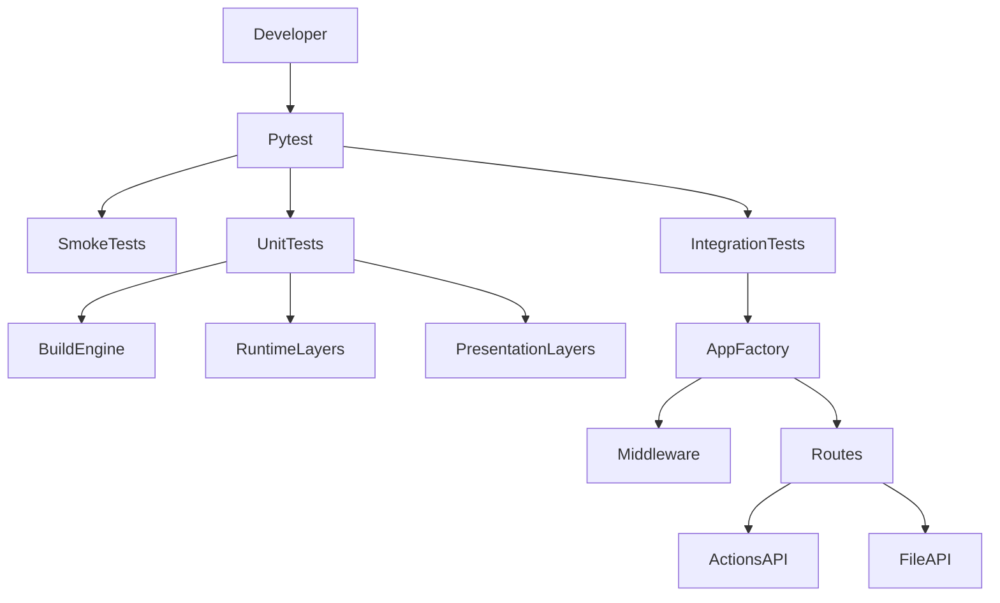

# STAR Testing Strategy

## Table of Contents

- [1. Testing Overview](#1-testing-overview)
- [2. Testing Philosophy](#2-testing-philosophy)
- [3. Test Suite Structure](#3-test-suite-structure)
- [4. Unit Testing](#4-unit-testing)
- [5. Integration Testing](#5-integration-testing)
- [6. Security Testing](#6-security-testing)
- [7. Test Fixtures and Utilities](#7-test-fixtures-and-utilities)
- [8. Running Tests Locally](#8-running-tests-locally)
- [9. CI Test Execution](#9-ci-test-execution)

## 1. Testing Overview

The STAR test suite validates both functional correctness and security-critical behavior.

The current tests cover:

- DSL loader, validator, and builder behavior
- runtime action rendering, execution, sanitization, and output building
- sensitive action parameter handling, including secret delivery and redaction
- public action catalog, public contracts, and serializers
- settings loading and validation
- request and response schemas
- middleware enforcement
- file API behavior and STAR-managed storage lifecycle
- runtime OpenAPI generation
- API integration tests for `/v1/actions`, `/v1/files` and public endpoints

The suite combines smoke tests, unit tests, and integration tests.



## 2. Testing Philosophy

The test suite is designed around deterministic execution and isolation.

> [!IMPORTANT]
> Tests are intentionally isolated from local shell variables and `.env` files. This prevents machine-specific configuration from changing test outcomes.

The current design goals are:

- deterministic behavior across runs
- strict isolation from local developer environments
- independence from `.env` files
- no reliance on test execution order
- coverage of both success paths and rejection paths
- direct validation of security-sensitive behavior for filesystem and HTTP handling

`tests/conftest.py` enforces this through the autouse fixture `clean_star_environment`.

`clean_star_environment`:

- removes all `STAR_*` variables from the process environment
- disables `.env` loading by setting `Settings.model_config["env_file"]` to `None`
- clears the cached `get_settings()` result before each test

## 3. Test Suite Structure

The test suite is organized under `tests/`.

| Path | Purpose |
| --- | --- |
| `tests/test_app_smoke.py` | Basic smoke coverage for app creation and `/health`. |
| `tests/actions/test_dispatcher.py` | Unit tests for runtime dispatch invariants, params validation, and propagated execution errors. |
| `tests/actions/test_registry.py` | Unit tests for registry build, lookup, membership, and deterministic listing behavior. |
| `tests/actions/build_engine` | Unit tests for DSL loading, validation, and action compilation. |
| `tests/actions/presentation` | Unit tests for module catalogs, public contracts, and serializers. |
| `tests/actions/runtime` | Unit tests for execution, rendering, output builders, and sanitization. |
| `tests/core` | Unit tests for configuration, schemas, and security helpers. |
| `tests/integration` | End-to-end HTTP validation for middleware, routes, files, and OpenAPI output. |

Within those directories:

- `tests/actions/test_dispatcher.py` covers HTTP-agnostic runtime dispatch behavior once an action has already been compiled into the registry
- `tests/actions/test_registry.py` covers immutable registry construction from DSL specs and action lookup semantics
- `tests/integration/routes/actions` covers action discovery, action specs, and action execution
- `tests/integration/routes/files` covers upload, metadata retrieval, listing, content download, and delete behavior
- `tests/integration/routes/test_endpoint_openapi.py` covers runtime OpenAPI projection
- `tests/integration/middleware` covers auth, observability, rate limiting, request IDs, request integrity, security headers, and timeout behavior

## 4. Unit Testing

Unit tests cover isolated behavior in the DSL engine, runtime layers, presentation layers, settings, schemas, and security helpers.

Current unit coverage includes:

- `tests/actions/test_dispatcher.py` for action resolution, params validation, executor handoff, and propagated runtime policy errors
- `tests/actions/test_registry.py` for registry construction from specs, namespace handling, lookup, membership, sorted listing, and built-in action contract regressions
- `tests/actions/build_engine/test_actions_loader.py` for YAML discovery, safety checks, parsing, and module loading
- `tests/actions/build_engine/test_actions_validator.py` for semantic DSL rules, uniqueness checks, binary constraints, output rules, template validation, and rejection of unsafe secret usage
- `tests/actions/build_engine/test_actions_builder.py` for runtime `ActionSpec` compilation, generated params models, defaults, command templates, sensitive delivery metadata, and output definitions
- `tests/actions/presentation/test_actions_catalog.py` for grouped module discovery and filtering by `q`, `tags`, and `match`
- `tests/actions/presentation/test_actions_contracts.py` for params contracts, params examples, response contracts, response examples, and public `secret` contract shape
- `tests/actions/presentation/test_actions_serializers.py` for stable public action and module serialization without leaking internal delivery policy
- `tests/actions/runtime/test_actions_renderer.py` for runtime argument resolution, const template interpolation, file input resolution, secret stdin/file delivery, and output placeholder creation
- `tests/actions/runtime/test_actions_executor.py` for binary policy checks, subprocess execution, stdin handoff, and timeout behavior
- `tests/actions/runtime/test_actions_outputs_builder.py` for output payload shaping and file finalization
- `tests/actions/runtime/test_actions_sanitizer.py` for stdout and stderr truncation, sensitive-prefix path redaction, invocation-secret redaction, and normalization
- `tests/core/test_settings.py` for environment-backed settings, defaults, docs toggles, output byte limits, blocked binaries, and token loading rules
- `tests/core/security/*` for path validation, secure file access helpers, HTTP validation helpers, and security headers

The unit suite does not assume a fixed public action catalog. Most action-specific tests build temporary DSL specs and compile deterministic registries inside the test process.

## 5. Integration Testing

Integration tests live under `tests/integration/` and validate the behavior of the running FastAPI application.

These tests instantiate the application through `create_app()` and exercise the HTTP surface with `TestClient`.

Middleware integration coverage includes:

- authentication enforcement and exempt endpoints in `test_middleware_auth.py`
- request integrity checks for content type, duplicate headers, conflicting `Content-Length` and `Transfer-Encoding`, and body size limits in `test_middleware_request_integrity.py`
- rate limiting behavior, `Retry-After`, exempt endpoints, and metric labels in `test_middleware_rate_limit.py`
- timeout handling, exempt routes, and timeout metrics in `test_middleware_timeout.py`
- request ID generation and propagation in `test_middleware_request_id.py`
- observability counters, duration histograms, error classification, inflight gauges, and path normalization in `test_middleware_observability.py`
- security header injection, overwrite behavior, and feature toggling in `test_middleware_security_headers.py`

Route integration coverage includes:

- `GET /v1/actions` discovery, filtering, and grouped response behavior
- `GET /v1/actions/{action_id}` public contract retrieval and unknown-action handling
- `POST /v1/actions/{action_id}` request validation, execution success, output encoding, declared command outputs, `stdout_as_file` behavior, and stable error mapping
- `/v1/files` upload, metadata retrieval, listing, content download, and delete behavior
- `/health` success payload validation
- `/metrics` Prometheus text format validation
- `/openapi.json` validation, public/private route projection, response header docs, and runtime action examples from the generated docs surface

## 6. Security Testing

The test suite includes direct coverage for security-critical logic.

In `tests/core/security`, the current tests validate:

- path traversal rejection
- absolute path rejection
- backslash rejection
- control character rejection
- sandbox root enforcement
- symlink rejection during path resolution
- safe opening of regular files without following symlinks
- strict `Content-Length` parsing and content type normalization

In `tests/actions/build_engine` and `tests/actions/runtime`, the current tests validate:

- rejection of malformed or unsafe YAML specs
- enforcement of binary policy rules
- validation of command token structure and template placeholders
- build-time and runtime rejection of secret values that would render into argv
- materialization and cleanup of invocation-owned secret temp files
- runtime rejection of invalid params, forbidden binaries, and bad output declarations
- redaction of invocation-provided secrets from sanitized subprocess output and omission of rejected input values from public validation errors

In `tests/integration/middleware` and `tests/integration/routes`, the current tests validate:

- authentication enforcement on protected endpoints
- correct behavior for unauthenticated exempt endpoints
- rejection of duplicate `Authorization` headers
- rejection of malformed request bodies and unsupported content types
- rejection of conflicting `Content-Length` and `Transfer-Encoding` headers
- enforcement of body and upload size limits
- rate limiting under low request budgets
- timeout enforcement and timeout exemptions for `/health` and `/metrics`
- request ID propagation on both successful and failing responses
- file API behavior through typed identifiers rather than direct path access

## 7. Test Fixtures and Utilities

Shared fixtures in `tests/conftest.py` provide the common test environment.

### Environment and configuration isolation

- `clean_star_environment` enforces environment isolation for every test
- `minimal_safe_env` sets a deterministic minimal STAR configuration with `STAR_API_TOKEN_DEV` and `STAR_ROOT_DIR`
- `settings` builds a valid `Settings` instance directly with `Settings.model_validate(...)`

### Registry and app fixtures

- `valid_registry` writes temporary DSL specs and builds a deterministic runtime registry for tests
- `app` creates a FastAPI application through `create_app(settings)`
- `client` returns a `TestClient` bound to that app
- `create_upload_app` returns isolated app instances for file route integration tests

### Authentication helpers

- `api_token` provides a deterministic bearer token for tests
- `auth_headers` returns `Authorization: Bearer <token>` headers for protected endpoint requests

### Filesystem and storage helpers

- `star_root_dir` creates a temporary STAR sandbox root directory
- `sandbox_file_factory` creates files inside the sandbox root and returns both absolute and sandbox-relative paths
- `upload_file_id` uploads files through the real API and returns generated UUIDs
- `file_factory` creates realistic sample files for MIME-sensitive tests

## 8. Running Tests Locally

The local entry point is defined in the `Makefile`.

Typical commands are:

```bash
make test
pytest -q tests
pytest -q tests/integration
```

Project-level pytest configuration in `pyproject.toml` sets:

- `testpaths = ["tests"]`
- `pythonpath = ["src"]`
- `addopts = "-ra --strict-markers"`

Testing dependencies are declared in `requirements/testing.txt`, and `requirements/dev.txt` includes the testing, linting, runtime, and security requirement sets.

## 9. CI Test Execution

The same test suite is executed automatically in GitHub Actions.

The CI workflow in `.github/workflows/ci.yml` creates a Python 3.12 virtual environment, installs `requirements/dev.txt`, and runs `make ci`. The `make ci` target includes the full pytest suite as part of the quality gate.

For pipeline details, see [docs/CI.md](./CI.md).

---
