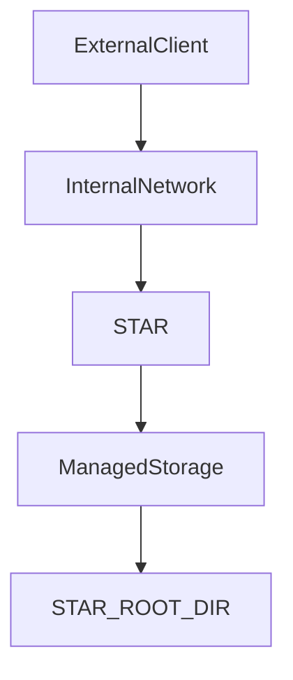
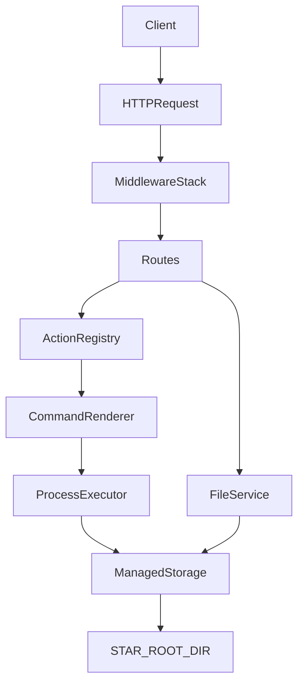

# STAR Threat Model

## Table of Contents

- [1. Security Overview](#1-security-overview)
- [2. Security Goals](#2-security-goals)
- [3. Protected Assets](#3-protected-assets)
- [4. Trust Boundaries](#4-trust-boundaries)
- [5. Attack Surface](#5-attack-surface)
- [6. Threat Categories](#6-threat-categories)
- [7. Security Mitigations](#7-security-mitigations)
- [8. Residual Risks](#8-residual-risks)
- [9. Security Assumptions](#9-security-assumptions)
- [10. Trust Boundary Diagram](#10-trust-boundary-diagram)

## 1. Security Overview

STAR is a secure automation runtime that is typically deployed as an internal FastAPI service and exposes authenticated action execution and managed file endpoints.

The service does not accept arbitrary commands from clients. Instead, it builds its runtime action registry from YAML DSL specs that are validated and compiled at startup. Execution requests can only target actions present in that immutable registry, and runtime execution is further constrained by rendered-command checks and binary policy enforcement.

STAR uses defense in depth through these mechanisms:

- bearer token authentication enforced by `AuthMiddleware`
- API token loading from the Docker secret `/run/secrets/star_api_token`
- request structure validation in `RequestIntegrityMiddleware`
- strict startup validation of DSL YAML spec files
- build-time and runtime binary policy checks
- managed file storage rooted at `STAR_ROOT_DIR`
- sandbox path enforcement in low-level filesystem helpers
- optional baseline response security headers
- container isolation and a non-root container user

This model aims to keep the exposed capability set small, deterministic, and observable.

## 2. Security Goals

The implemented security goals are:

- prevent unauthorized callers from accessing protected endpoints
- prevent arbitrary command execution outside the DSL-defined action surface
- reject unsafe or malformed DSL module definitions before they become executable actions
- prevent filesystem access outside STAR-managed storage boundaries
- reject malformed or structurally unsafe HTTP requests early
- limit denial of service through oversized requests, request flooding, and long-running operations
- keep action behavior deterministic by validating inputs, command rendering, and declared outputs

These goals do not include multi-tenant isolation or public Internet exposure.

## 3. Protected Assets

STAR protects these assets:

- Host integrity. The service reduces host exposure by running in a container, using a non-root user, and restricting storage to a mounted STAR root directory.
- Managed storage contents. File uploads, action outputs, blobs, and metadata are limited to a strict root boundary at `STAR_ROOT_DIR`.
- Action execution environment. Only DSL-defined actions that passed startup validation can run through `POST /v1/actions/{action_id}`.
- Authentication token. The bearer token gates protected endpoints and is loaded from a Docker secret path.
- Service availability. Body size limits, rate limiting, and request timeouts protect the service from simple abuse patterns.
- Integrity of action results. Param validation, runtime rendering checks, binary policy enforcement, and output sanitization reduce malformed execution results.
- Observability data. Request IDs and Prometheus metrics support incident analysis and abuse detection.

## 4. Trust Boundaries

STAR has three primary trust boundaries.

1. HTTP boundary. Requests cross from trusted Docker-network peers or trusted host-local clients into the STAR application.
2. Application to storage boundary. Validated API input is converted into managed file operations and controlled subprocess execution rooted in `STAR_ROOT_DIR`.
3. Container boundary. STAR relies on the container runtime to isolate the process from the rest of the host environment.

Trust assumptions exist at each boundary:

- clients are expected to come from trusted Docker-network peers or trusted host-local access paths, but requests are still treated as untrusted input
- the STAR root directory is treated as the permitted storage boundary
- container isolation and Docker secret mounting are assumed to work correctly

## 5. Attack Surface

The application exposes these HTTP entry points:

- `/v1/actions` via GET. This endpoint lists registered runtime actions and accepts optional discovery filters.
- `/v1/actions/{action_id}` via GET. This endpoint returns the public contract of one runtime action.
- `/v1/actions/{action_id}` via POST. This is the main execution attack surface because it accepts action-specific parameters for the selected `action_id`.
- `/v1/files` via POST and GET. These endpoints handle managed file upload and listing.
- `/v1/files/{id}` via GET and DELETE. These endpoints handle managed file metadata retrieval and deletion by `file_id`.
- `/v1/files/{id}/content` via GET. This endpoint streams file content by `file_id`.
- `/health` via GET. This endpoint is unauthenticated.
- `/metrics` via GET. This endpoint is unauthenticated.
- `/docs`, `/redoc`, and `/openapi.json` while `star_enable_docs` is enabled. These endpoints are unauthenticated whenever exposed. Source-tree deployments often keep them off, while the packaged local deploy flow may enable them for localhost exploration, so they should stay disabled for wider or production-oriented exposure.

Attack inputs include:

- request headers, especially `Authorization`, `Content-Type`, `Content-Length`, `Transfer-Encoding`, and `X-Request-Id`
- request body content sent to `POST /v1/actions/{action_id}` and multipart form uploads sent to `/v1/files`
- `action_id` path parameters on `GET /v1/actions/{action_id}` and `POST /v1/actions/{action_id}`
- discovery query parameters such as `q`, `tags`, and `match` on `GET /v1/actions`
- `file_id` path parameters and file query or filter parameters on `/v1/files` routes
- environment and secret based configuration such as `STAR_ROOT_DIR` and the API token secret

Authentication coverage is as follows:

- `/v1/actions` requires bearer authentication
- `GET /v1/actions/{action_id}` requires bearer authentication
- `POST /v1/actions/{action_id}` requires bearer authentication
- `/v1/files`, `/v1/files/{id}`, and `/v1/files/{id}/content` require bearer authentication
- `/health` does not require authentication
- `/metrics` does not require authentication
- docs endpoints do not require authentication while they are enabled

## 6. Threat Categories

### Authentication threats

- token guessing against the bearer token check
- missing or malformed `Authorization` headers
- duplicate `Authorization` headers intended to confuse downstream handling
- exposure of unauthenticated endpoints such as `/health`, `/metrics`, and docs endpoints when they remain enabled
- action enumeration through authenticated discovery routes
- abuse of authenticated `/v1/files` endpoints through high-volume upload, listing, and download requests

### Input validation threats

- malformed request paths containing disallowed bytes or separators
- malformed raw headers
- unsupported content types for `POST /v1/actions/{action_id}`
- unsupported content types for `/v1/files` uploads
- invalid `Content-Length` values
- oversized request bodies
- invalid action parameters that do not match the generated Pydantic model

### Filesystem threats

- escaping the managed storage root
- sandbox traversal using `..`
- absolute path access
- backslash based alternate path syntax
- symlink abuse in existing path components or final file opens
- use of non-regular files where regular files are expected
- abuse of stored blob identifiers or metadata transitions

### Action execution threats

- invoking an action name that is not present in the built registry
- attempting to bypass action contracts with malformed parameters
- attempting to smuggle unsafe values through template placeholders or rendered argv
- use of blocked or non-allowlisted binaries
- abuse of declared outputs to force unsafe file handling
- returning unsafe or excessively large process output

### Denial of service threats

- request flooding against protected endpoints
- oversized request payloads
- operations that block or run longer than the configured timeout
- expensive upload, download, or file listing patterns
- metrics scraping or docs access generating extra unauthenticated load

### Request smuggling and parser confusion

- conflicting `Content-Length` and `Transfer-Encoding` headers
- duplicate `Authorization` headers

## 7. Security Mitigations

### Authentication mitigations

- `AuthMiddleware` enforces `Authorization: Bearer <token>` on protected endpoints.
- Token comparison uses `hmac.compare_digest()`.
- The token is loaded from `/run/secrets/star_api_token` by `load_star_api_token()`.
- `validate_api_token()` enforces a minimum length and mixed character classes.
- Duplicate `Authorization` headers are rejected earlier by `RequestIntegrityMiddleware`.

### Input validation mitigations

- `RequestIntegrityMiddleware` rejects malformed paths, malformed raw headers, invalid `Content-Length`, unsupported content types, and oversized bodies.
- `ContentTypePolicy` restricts `POST /v1/actions/{action_id}` to `application/json` and `POST /v1/files` to `multipart/form-data`.
- Action execution validates params against the action-specific generated `params_model`.
- Runtime rendering rejects invalid placeholder values and `None` values before execution.

### DSL build and execution mitigations

- YAML specs are discovered deterministically and checked for file size, extension, UTF-8 safety, NUL bytes, disallowed control characters, and dangerous YAML patterns.
- `validate_modules()` rejects unsupported DSL versions, duplicate module identities, invalid identifiers, blocked binaries, and malformed action declarations.
- `build_actions()` compiles only validated modules into immutable runtime `ActionSpec` objects.
- The registry is an explicit in-memory allowlist built from validated DSL specs.
- `execute_command()` rejects binary paths, blocked binaries, and non-allowlisted binaries before subprocess execution.

### Filesystem mitigations

- `/v1/files` exposes UUID-based managed storage instead of arbitrary path-based reads and writes.
- `sanitize_rel_path()` rejects NUL bytes, control characters, absolute paths, backslashes, empty paths, long paths, and traversal segments.
- `resolve_in_sandbox()` checks the resolved path against the strict sandbox root boundary.
- Existing symlink path components are rejected during sandbox resolution.
- `safe_open_no_follow()` uses `O_NOFOLLOW` when available and verifies that the opened target is a regular file.
- Storage helpers keep blobs and metadata rooted under `STAR_ROOT_DIR`.

### Action output mitigations

- Stdout and stderr are transformed through the runtime sanitizer before they are returned, by redacting sensitive filesystem paths under static internal prefixes and the runtime `STAR_ROOT_DIR`.
- Configurable stdout and stderr size limits can truncate returned output.
- Declared file outputs are handled through runtime placeholder and output-builder logic instead of trusting client-supplied destination paths.

### Denial of service mitigations

- `RequestIntegrityMiddleware` enforces request body size limits using `star_max_file_bytes`.
- `RateLimitMiddleware` applies a process-local token bucket using `star_rate_limit_rps`.
- `TimeoutMiddleware` aborts long running requests using `star_timeout_ms`.
- Upload and content-processing paths enforce size-aware behavior before persisting or returning data.

### Request smuggling mitigations

- `RequestIntegrityMiddleware` rejects requests that contain both `Content-Length` and `Transfer-Encoding`.
- Raw header inspection rejects duplicate `Authorization` headers and control characters in headers.

## 8. Residual Risks

Some risks remain by design or by deployment assumption.

> [!WARNING]
> `/health`, `/metrics`, and OpenAPI docs endpoints can be reached without authentication while docs are enabled. Keep STAR within trusted network boundaries, keep localhost-only publishing by default unless a wider bind is intentional, and disable docs for wider or production-oriented exposure even though local packaged deployments may enable them for exploration.

- STAR relies on container isolation. If the container runtime is misconfigured or compromised, container-level protections may not hold.
- STAR relies on correct storage root configuration. An incorrect `STAR_ROOT_DIR` mount target weakens the filesystem boundary.
- `RateLimitMiddleware` is process-local. In multi-process or multi-instance deployments, each process keeps an independent token bucket.
- `/health` and `/metrics` are intentionally unauthenticated. Docs endpoints are also unauthenticated while enabled and increase reachable surface inside the trusted network boundary.
- Filesystem race conditions are reduced but not fully eliminated. The code explicitly notes TOCTOU limitations around some path-resolution patterns.
- Service availability still depends on the underlying container host, mounted volume performance, and upstream request volume.

## 9. Security Assumptions

The security model depends on these assumptions:

- STAR runs within trusted network boundaries.
- The container runtime correctly isolates the STAR process.
- The API token secret is stored securely and mounted correctly at `/run/secrets/star_api_token`.
- `STAR_ROOT_DIR` points to the intended mounted storage volume.
- Upstream services and operators treat STAR as a trusted internal component and do not expose it directly to untrusted public traffic.
- Operators leave docs endpoints disabled or localhost-scoped in environments where exposing them is not acceptable.

If these assumptions are violated, the practical security of the service is reduced even if the application code itself is unchanged.

## 10. Trust Boundary Diagram

This flow summarizes the security model. Requests cross the HTTP boundary, pass through layered middleware checks, reach either the runtime action path or the managed file path, and interact with storage only through STAR-controlled helpers.

---
