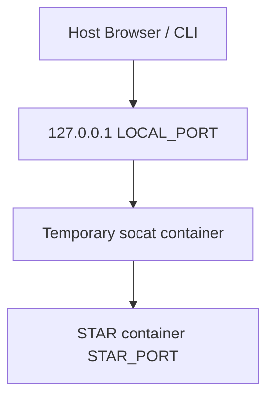

# star-forward.sh - Technical Specification

## Purpose

`star-forward.sh` is a host-side development utility that creates a temporary
local port-forward to a running **Secure Templated Actions Runtime (STAR)** container.

The script enables developers to access STAR endpoints from the host machine
without exposing container ports in `docker-compose.yml`, preserving the
internal-only networking design of the STAR architecture.

Typical use cases include:

- Accessing interactive API documentation (`/docs`)
- Running local debugging requests (`curl`, Postman, REST clients)
- Executing integration tests against the containerized service
- Inspecting runtime behavior without running a separate local instance

---

## Scope & Responsibilities

The script has a **single responsibility**:

- Create a temporary TCP port-forward from `localhost` to a running STAR container.

It explicitly **does NOT**:

- Start or stop Docker containers
- Launch Docker Compose stacks
- Modify Docker networking configuration
- Persist port mappings in container definitions
- Manage authentication or runtime configuration
- Alter STAR runtime behavior

---

## Execution Model

The script runs **on the host** and relies on the Docker CLI to create a
temporary forwarding container.

The forwarding container:

- Runs the `alpine/socat` image
- Connects to the same Docker network as STAR
- Exposes a local TCP port bound to `127.0.0.1`
- Forwards traffic to the STAR container port

The forward remains active **until the container exits** (usually via `CTRL+C`).

---

## Supported Flags

| Flag                  | Description                              |
| --------------------- | ---------------------------------------- |
| `--env-file <path>`   | Load configuration from a `.env` file    |
| `--container <name>`  | Explicitly specify the STAR container     |
| `--local-port <port>` | Force a specific local port              |
| `--dry-run`           | Print intended actions without executing |
| `--help`, `-h`        | Display usage information                |

---

## Environment Variable Requirements

### Required Variables

These variables must be defined either through `--env-file` or already exported
in the environment.

| Variable                | Description                                                 |
| ----------------------- | ----------------------------------------------------------- |
| `STAR_SHARED_NETWORK` | Docker network used by STAR                                  |
| `STAR_PORT`              | Internal TCP port used by STAR                               |

`COMPOSE_PROJECT_NAME` is also required when `--container` is not provided,
because automatic container detection derives a name prefix from it.

If any required variable is missing, the script exits with an error.

---

## STAR Container Resolution

The script resolves the target container using the following logic:

### Case 1 - Explicit Container

If the `--container` flag is provided:

- The specified container name is validated
- The container must appear in `docker ps`
- If the container is not running, the script exits with an error

### Case 2 - Automatic Detection

If `--container` is not provided:

- The script derives the container prefix using:

```bash
$COMPOSE_PROJECT_NAME-star
```

- Running containers are filtered by this prefix
- The script behaves as follows:

| Condition        | Behavior                            |
| ---------------- | ----------------------------------- |
| No matches       | Script exits with error             |
| One match        | Container is selected automatically |
| Multiple matches | Script prints warning and exits     |

This prevents ambiguous routing in scaled deployments.

---

## Local Port Selection

If `--local-port` is not provided:

- The script scans a predefined port range (`8081-8099`)
- The first available port is selected

Port availability is determined by checking:

- Active host TCP listeners
- Docker-published ports

If no available port is found, the script exits with an error.

---

## Forwarding Architecture

The forwarding topology is:



The forwarding container is launched using:

```bash
docker run --rm \
  --network "$STAR_SHARED_NETWORK" \
  -p "127.0.0.1:${LOCAL_PORT}:${STAR_PORT}" \
  alpine/socat \
  TCP-LISTEN:${STAR_PORT},fork,reuseaddr \
  TCP:${STAR_CONTAINER}:${STAR_PORT}
```

All TCP traffic received on the local port is forwarded to STAR.

---

## Accessible Endpoints

The forward allows access to **any STAR endpoint**, including but not limited to:

| Endpoint                  | Description                             |
| ------------------------- | --------------------------------------- |
| `/docs`                   | Swagger UI                              |
| `/openapi.json`           | OpenAPI specification                   |
| `/health`                 | Health check                            |
| `/v1/actions`             | Action discovery endpoint               |
| `/v1/actions/{action_id}` | Action spec (GET) and execution (POST)  |
| `/metrics`                | Prometheus metrics                      |

This enables full API interaction from the host.

---

## Dry-Run Mode (`--dry-run`)

When `--dry-run` is enabled:

- No containers are started
- No ports are bound
- No Docker commands are executed

Instead, the script prints:

- The resolved container
- Selected port
- Intended `docker run` command

are printed to stdout.

---

## Security Properties

The script preserves STAR's internal network security model:

- STAR ports remain unexposed in `docker-compose.yml`
- The forward binds only to `127.0.0.1`
- The proxy container is ephemeral
- No persistent network configuration is modified

This ensures the service remains inaccessible from external networks.

---

## Idempotency

The script is **stateless** and safe to run repeatedly.

Each execution:

- Creates a new temporary proxy container
- Selects an available local port
- Cleans up automatically when the container exits

---

## Intended Usage

Typical workflow:

```bash
docker compose up -d star
scripts/star-forward.sh --env-file .env
```

Once started, developers can access:

```bash
http://localhost:$PORT/docs
```

or interact with any STAR endpoint locally.

---

## Non-Goals

The script intentionally does not:

- Provide production ingress
- Replace reverse proxies or API gateways
- Handle container lifecycle management
- Persist forwarding configuration

---

## Summary

`star-forward.sh` provides a secure and ergonomic mechanism for accessing
a containerized STAR instance during development without weakening the
service's internal networking model.

The design prioritizes:

- developer experience
- operational safety
- minimal infrastructure footprint
- explicit configuration

This script complements STAR's DevSecOps tooling and is suitable for use in
local development environments and CI pipelines.
